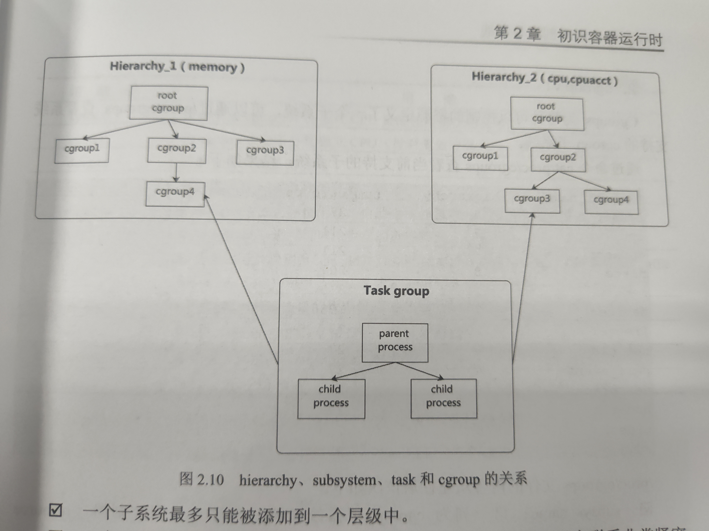

# 容器运行时概述
container runtime是一个管理容器所有运行进程的工具，包括创建、删除容器、打包和共享容器。
低级容器运行时：和底层操作系统打交道，管理容器的生命周期，常见的容器运行时如runc，
高级容器运行时：是对低级容器运行时的进一步封装，专注于多个容器管理及容器镜像管理，常见的容器运行时：containerd，Docker，cri-o,podman

容器的本质是 Namespace + Cgroups + rootfs
# Cgroups
- `cgroup控制组`：以控制组为单元来进行资源控制，控制组是由树状结构关系的，子控制组汇集成夫控制组的属性（资源配额，限制）
- `subsys_name子系统` 或 `controller控制器`：如memory controller可以控制内存，cpu...
- `hierarchy层级`：作为控制组的根目录来绑定 `子系统`从而达到资源的控制。一个子系统最多能被添加到一个层级中。
- `task任务`：父子进程

Cgroups v1中，各个子系统都是独自实现并单独挂载

# containerd
是一个守护进程，在单个主机上管理主机完整的容器生命周期，包括创建、启动、停止容器以及存储镜像、配置挂载、配置网络等。
containerd 从docker Engine剥离出来
可以`ctr version`查看版本
```bash
aiedge@master-test-251:~$ kubectl get no -Aowide
NAME              STATUS     ROLES           AGE   VERSION   INTERNAL-IP      EXTERNAL-IP   OS-IMAGE             KERNEL-VERSION      CONTAINER-RUNTIME
master-test-251   Ready      control-plane   77d   v1.25.3   192.168.20.251   <none>        Ubuntu 20.04.6 LTS   5.4.0-174-generic   containerd://1.6.20
worker-test-252   Ready   <none>          76d   v1.25.3   192.168.20.252   <none>        Ubuntu 20.04.6 LTS   5.4.0-170-generic   containerd://1.6.20
worker-test-253   Ready   <none>          76d   v1.25.3   192.168.20.253   <none>        Ubuntu 20.04.6 LTS   5.4.0-170-generic   containerd://1.6.20
```
## namespace
containerd 相比Docker多了`namespace`的概念，常见的namespace：`default`，`moby`，`k8s.io`
`default`：不指定时默认
`moby`：Docker使用的namespace
`k8s.io`：kubelet与crictl使用的namespace
`ctr -n k8s.io image ls`
## 容器操作
`ctr -n k8s.io container ls`查看容器列表
`ctr -n k8s.io task ls`查看运行的容器列表
`ctr run`等效于`ctr container create`+`ctr task start`
`ctr c info nginx_1`查看容器详细配置
`ctr  -n k8s.io t metrics nginx_1`查看容器使用指标
`ctr  -n k8s.io exec --exec-id 0 -t nginx`

# containerd 与 容器网络
**容器运行时负责调用CNI插件，由CNI插件执行特定网络配置功能的程序**
> `Dockershim`不支持CNI，k8s1.24移除了`Dockershim`之后，CNI的管理不再是kubelet的工作，而是对应的cri（containerd）来进行管理

- CNI插件配置文件 默认在`/etc/cni/net.d`中
- CNI插件二进制 默认在`opt/cni/bin`中

## 配置容器网络
`ip netns list` 其实就是`/var/run/netns`目录下的文件
`ip netns add NAME`
`ip netns attach NAME PID`
`ip netns set NAME NETNSID`

`ip netns exec <net ns> <shell>`

## 插件分类
### main类插件
即接口式插件
#### bridge插件
在宿主机上创建一个`Linux bridge设备`（虚拟交换机），然后通过`veth pair`将网桥和容器网络命名空间中的接口连接起来，实现容器网络互通以及容器和主机网络互通。

#### VLAN插件


### ipam类插件
`ipam`即`ip address management`
dhcp：向DHCP服务器发送DHCP请求
host-local 维护本地数据库进行IP分配
static：静态，为容器分配指定的地址
### meta类插件
即链式插件


