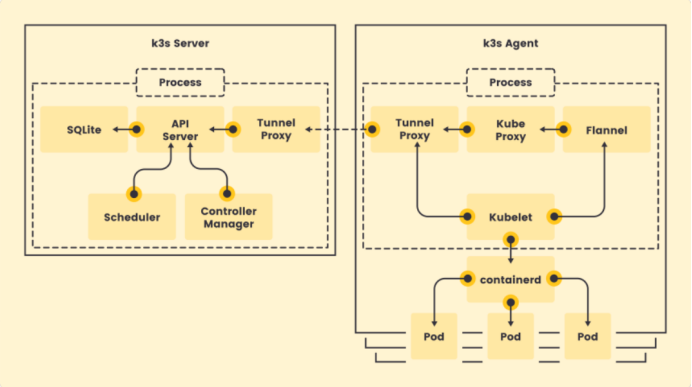

## 架构

- k3s Server：一个进程，包含了API Server, Scheduler, Controller Manager, 以及代替了etcd 的SQLite, 和k3s Agent通信的Tunnel Proxy
- K3s Agent：两个进程体，第一个进程包含Kube Proxy, Kubelet, Flannel, Tunnel Proxy; 第二个进程是containerd，负责管理运行容器。
删除了一些旧的非必要的代码；将一些组件打包到一起（一个进程）；使用containerd作为容器运行时；引入SQLite作为可选的存储源。