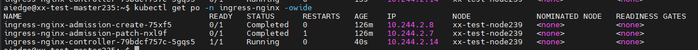
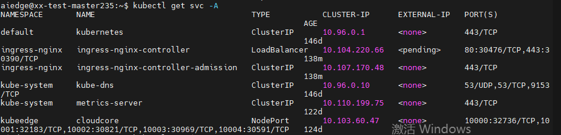

# 创建Ingress

## ingress-nginx

<https://kubernetes.github.io/ingress-nginx/user-guide/basic-usage/>

### 部署ingress-nginx 

 <https://kubernetes.github.io/ingress-nginx/deploy/>

#### 1. 部署ingress-nginx controller

```bash
kubectl apply -f https://raw.githubusercontent.com/kubernetes/ingress-nginx/controller-v1.8.2/deploy/static/provider/cloud/deploy.yaml
```



 

`30476`为访问端口

#### 2. 部署ingress

```yaml
ingressClassName: nginx
```

如下示例：

```yaml
apiVersion: networking.k8s.io/v1
kind: Ingress
metadata:
  name: <YourServiceName>
  namespace: <YourServiceNamespace>
  ownerReferences:
  - apiVersion: v1
    blockOwnerDeletion: true
    controller: true
    kind: Service
    name: <YourServiceName>
spec:
  ingressClassName: nginx
  rules:
  - host: example.com
    http:
      paths:
      - path: /
        pathType: Prefix
        backend:
          service:
            name: <YourServiceName>
            port:
              number: 80

```

 `kubectl get ingress`

使用`example.com:30476`

记得在主机上加上域名解析

```bash
 sudo vim /etc/hosts
```

```bash
# 加上
192.168.20.239 example.com
# 其中192.168.20.239是Ingress Controller 服务的外部 IP 地址（所在的主机IP）
```

```
curl example.com:30476
```

