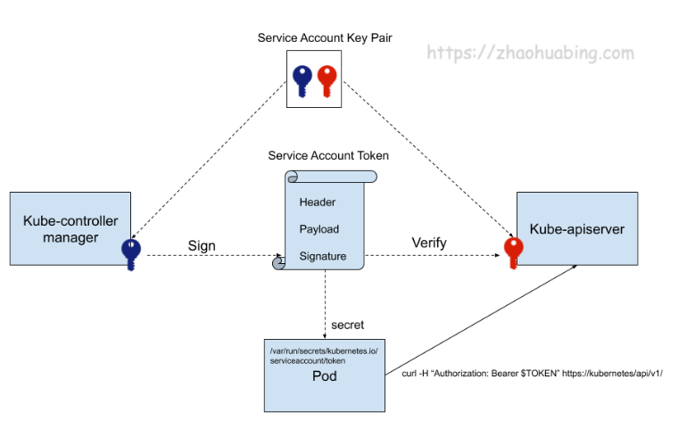

# [kubernetes](https://so.csdn.net/so/search?q=kubernetes&spm=1001.2101.3001.7020) API 访问控制

## 四阶段 

Kubernetes API 的请求从发起到其持久化入库的一个流程：


- Authentication 认证阶段：判断请求用户是否为能够访问集群的合法用户。如果用户是个非法用户，那 apiserver 会返回一个 401 的状态码，并终止该请求；
-  Authorization 鉴权阶段。在该阶段中 apiserver 会判断用户是否有权限进行请求中的操作。如果无权进行操作，apiserver 会返回 403 的状态码，并同样终止该请求；
- AdmissionControl。在该阶段中 apiserver 的 admission controller 会判断请求是否是一个安全合规的请求。如果最终验证通过的话，访问控制流程才会结束。比如：创建 pod 时添加 initContainer 或者校验字段等。准入控制最常使用的扩展方式就是 [admission webhooks](https://kubernetes.io/docs/reference/access-authn-authz/extensible-admission-controllers/#what-are-admission-webhooks)

上述三阶段通过后，进入持久化阶段

## 身份认证和授权

## 认证

kube-apiserver支持多种认证机制，并支持同时开启多个认证功能。当客户端发起一个请求，经过认证阶段时，只要有一个认证器通过，则认证成功。

### 9种认证机制

kube-apiserver目前提供了9种认证机制，分别是BasicAuth、ClientCA、TokenAuth、BootstrapToken、RequestHeader、WebhookTokenAuth、Anonymous、OIDC、ServiceAccountAuth。只要有一种认证方式通过，就不再对其它方式认证。

- BasicAuth：客户端将用户、密码写入请求头中（key为Authorization，value为`Basic BASE64ENCODED（USER：PASSWORD）`，其中用户名及密码是通过Base64编码后的字符串）

  ```
  指定--basic-auth-file参数启用BasicAuth认证。
  AUTH_FILE是一个CSV文件，每个用户在CSV中的表现形式为password、username、uid
  ```

  

- ClientCA：也被称为TLS双向认证，即服务端与客户端互相验证证书的正确性。CA签名过的证书都可以通过验证。**比如 kubectl 请求 apiserver 时**，.kube/config文件。

  ```
  指定--client-ca-file参数启用ClientCA认证。
  ```

  

- TokenAuth：基于Token的认证。

  ```
  通过指定--token-auth-file参数启用TokenAuth认证。
  TOKEN_FILE是一个CSV文件，每个用户在CSV中的表现形式为token、user、userid、group
  ```

  

- BootstrapToken：客户端的Token信息与服务端的Token相匹配，则认证通过，自动为节点颁发证书，这是一种引导Token的机制。

  ```
  key为Authorization，value为Bearer<TOKENS>
  
  指定--enable-bootstrap-token-auth参数启用BootstrapToken认证。
  
  ```

  

- RequestHeader：主要是用来与身份认证代理（eg, ingress , nginx）使用

- WebhookTokenAuth：webhoook钩子，将验证信息发送给远程的Webhook服务器进行认证

- Anonymous：匿名认证

- OIDC：基于OAuth 2.0协议的轻量级认证规范

- ServiceAccountAuth：服务账户令牌。ServiceAccountAuth是一种特殊的认证机制，其他认证机制都是处于Kubernetes集群外部而希望访问kube-apiserver组件，而ServiceAccountAuth认证是**从Pod资源内部访问kube-apiserver组件，提供给运行在Pod资源中的进程使用，它为Pod资源中的进程提供必要的身份证明，从而获取集群的信息**。

  ```
  --service-account-key-file 包含签名承载Token的PEM编码密钥的文件，用于验证Service Account Token
  -service-account-lookup
   ：用于验证Service Account Token是否存在于Etcd中
  ```


### 客户端

访问k8s的API Server的客户端主要分为两类：

- kubectl: 用户家目录种的.kube/config就保存了密钥相关信息，自动读取
- pod: pod中的进程需要访问API Server。如果是人去访问或编写的脚本去访问，这类访问的帐号为：UserAccount;pod自身访问时使用的帐号时ServerAccount,生产中后者使用居多。
  

### 使用

```bash
# 查看集群支持的认证机制 查看集群证书
sudo cat /etc/kubernetes/manifests/kube-apiserver.yaml
# - --client-ca-file=/etc/kubernetes/pki/ca.crt 启用ClientCA认证 使用 TLS/SSL 证书对客户端进行认证
# - --enable-bootstrap-token-auth=true 用于在集群引导过程中对节点进行身份验证。BootstrapToken

# 三个文件：CA 证书文件 客户端证书 客户端私钥
# 具体内容也可以看 cat ~/.kube/config

curl --cacert /etc/kubernetes/pki/ca.crt --cert /etc/kubernetes/pki/apiserver-kubelet-client.crt --key /etc/kubernetes/pki/apiserver-kubelet-client.key https://192.168.20.235:6443/api/v1/namespaces/kube-flannel/pods/kube-flannel-ds-5vmkr

```


## 认证——用户

认证解决的问题是识别用户的身份，那 kubernetes 中都有哪几种用户？

Kubernetes的两类用户：


### Normal Users：普通用户

一般由外部独立服务管理，前面介绍的认证机制（如BasicAuth、OIDC认证等）都属于普通用户，Kubernetes没有为这类用户设置用户资源对象。平时常用的**kubectl命令都是普通用户执行**的。


无法通过 kubernetes API 调用来添加给kubernetes增加普通用户，**普通用户是通过创建证书和切换上下文环境的方式来创建和切换用户。**Kubernetes 认为能够提供由集群的证书 机构签名的合法证书的用户是通过身份认证的用户。

使用 `sudo cat ./.kube/config`查看集群默认生成的**管理员用户**，或者`kube config`


#### 创建普通用户

a. 创建证书   `openssl `

b. 生成账号

`$ kubectl config set-credentials devuser --client-certificate=./devuser.crt --client-key=./devuser.key --embed-certs=true `建立用户和证书的关系，再次使用`kubectl config view`查看配置可以发现多了一个 user 的配置项

c. 设置上下文参数

设置上下文， 默认会保存在 $HOME/.kube/config 

$ kubectl config set-context devuser@kubernetes --cluster=kubernetes --user=devuser --namespace=dev  把集群信息和用户信息进行关联

查看 

$ kubectl config get-contexts

d. 设置默认上下文

 kubectl config use-context devuser@kubernetes

### kubeconfig配置文件

基于无状态协议的HTTP/HTTPS的API Server需要验证每次连接请求中的用户身份，且步骤复杂。为此，Kubemetes设计了 一种名为kubeconfig的配置文件，它存储了接入-到多个Kubernetes集群的相关配置信息(包括身份认证信息)，便于客户端加载并认证到API Server.

`sudo cat ./.kube/config`

kubeconfig配置文件主要部分说明如下:
●clusters: Kubereres集群的访问端点(API Server地址)列表
●users: 认证到API Server的身份凭据列表(eg: token. 数字证书)
●contexts: 用于指明哪个用户关联到哪个集群(user与cluster建立关联关系的上下文列表)
●current-context:当前默认使用的context

### Service Account： 服务账户

**Service Account** ：**服务账户**，是由Kubernetes API Server管理的用户，它们被绑定到指定的命名空间，由Kubernetes API Server自动或手动创建。**Service Account是为了Pod资源中的进程方便与Kubernetes API Server进行通信而设置的。**

这个ServiceAccount就相当于是拥有某个角色的账号，也就拥有了某些权限。

#### 内容

serviceaccounts 主要包含了三个内容 ，它们都通过mount命令的方式挂载在Pod的文件系统中`/var/run/secrets/kubernetes.io/serviceaccount/`目录下：

- **Namespace**：指定了Pod所在的命名空间。`/var/run/secrets/kubernetes.io/serviceaccount/namespace`
- **CA**：kube-apiserver组件的CA公钥证书，是Pod中的进程对kube-apiserver进行验证的证书。`/var/run/secrets/kubernetes.io/serviceaccount/ca.crt`
- **Token**：用作身份验证，通过kube-apiserver私钥签发（Sign）经过Base64编码的Bearer Token。`/var/run/secrets/kubernetes.io/serviceaccount/token`

#### Service Account token 认证

**在每个Namespace下都有一个名为default的默认Service Account对象**。若创建的pod未自己指定Service Account，K8s 会为其绑定默认的 Service Account。在这个ServiceAccount里面有一个名为Tokens的可以当做Volume被挂载到Pod里的Secret，当Pod启动时，这个Secret会自动被挂载到Pod的指定目录下，**Pod中的容器可以使用该Token与Kubernetes API服务器进行通信，以便进行身份验证和授权。**

Service Account Token其认证原理是**基于 JWT**， JWT 认证机制的原理也是通过 CA 根证书进行签名和公私钥校验 token。其中公钥和私钥分别被配置到了 API Server 和 Controller-Manager 的命令行参数中

 Pod 使用 token 来访问 API Server 了。API Server 再验证对应 token 信息，就能知道这个 token 是对应 Service Account，最后识别到对应 Service Account 的权限。




可以看一下`aiedge@master-test-251:~$ kubectl get po -n pipeline pipeline-sample1-0-6c86fbd558-n82bn -oyaml`

```yaml
 volumeMounts:
    - mountPath: /var/run/secrets/kubernetes.io/serviceaccount
      name: kube-api-access-b4ctl
      readOnly: true
  volumes:
  - name: kube-api-access-b4ctl
    projected: #  Projected 卷类型： 投射卷。允许您将多个已有的卷（且可以是不同类型的卷，ConfigMap Secret Downward ServiceAccountToken）源映射到Pod内的同一目录中。
      defaultMode: 420 # 默认权限模式
      sources:
      - serviceAccountToken:
          expirationSeconds: 3607 # 过期时间
          path: token # 路径
      - configMap: # 存储应用程序的配置数据
          items:
          - key: ca.crt
            path: ca.crt
          name: kube-root-ca.crt
      - downwardAPI: # 允许Pod将其元数据（例如Pod的名称、IP地址、标签和注释等）暴露给容器作为环境变量或卷中的文件。支持两种方式：作为环境变量或作为文件注入容器
          items:
          - fieldRef:
              apiVersion: v1
              fieldPath: metadata.namespace
            path: namespace
  serviceAccount: default
  serviceAccountName: default

```


## **授权**

当API Server被调用时，需要先进行用户认证，然后通过授权策略执行用户授权。

### 6种授权机制

kube-apiserver目前提供了6种授权机制，授权策略通过API Server启动参数`--authorization-mode`设置：

（1）AlwaysDeny：拒绝所有请求

（2）AlwaysAllow：允许接收所有请求

（3）**ABAC**（Attributed-Based Access Control）：基于属性的访问控制，表示使用用户配置的授权规则对用户请求进行匹配和控制

（4）**Webhook**：通过调用外部REST服务对用户进行授权

（5）**RBAC**：<u>Role-Based Access Control</u>，基于角色的访问控制

（6）**Node**：一种专用模式，用于对kubelet发起的请求进行访问控制

```bash
sudo cat /etc/kubernetes/manifests/kube-apiserver.yaml #查看授权策略

# 如 --authorization-mode=RBAC,node
```


### RBAC授权模式

RBAC（Role-Based Access Control）基于角色的访问控制。权限与角色相关联，形成了用户—角色—权限的授权模型。用户通过加入某些角色从而得到这些角色的操作权限，这极大地简化了权限管理。

在中间加一层角色，是为了增加安全性和效率，而且后续扩展上也会提升不少。


### RBAC资源对象

RBAC有四个资源对象，分别是Role、ClusterRole、RoleBinding、ClusterRoleBinding

#### 角色

- **Role**

  **一组权限的集合**，在一个命名空间中，可以用其来定义一个角色，**只能对命名空间内的资源进行授权**。

  ```yaml
  #定义一个角色用来读取Pod的权限,允许读取core API组的Pods资源
  apiVersion: rbac.authorization.k8s.io/v1
  kind: Role
  metadata:
    namespace: rbac
    name: pod-read
  rules:
  - apiGroups: [""]      #支持的API组列表
    resources: ["pods"]  #支持的资源对象列表
    resourceNames: []    #指定resource的名称
    verbs: ["get","watch","list"] #对资源对象的操作方法列表
  ```

  查看 `kubectl get roles -n rbac`

- **ClusterRole**

  具有和角色一致的**命名空间资源**的管理能力，还可用于授权 **集群级别的资源**、非资源型的路径、包含全部命名空间的资源

  ```yaml
  #定义一个集群角色可让用户访问任意secrets
  apiVersion: rbac.authorization.k8s.io/v1
  kind: ClusterRole
  metadata:
    name: secrets-clusterrole
  rules:
  - apiGroups: [""]
    resources: ["secrets"]
    verbs: ["get","watch","list"]
  ```


##### **相关参数** 

1、Role、ClsuterRole **Verbs**可配置参数

```bash
"get", "list", "watch", "create", "update", "patch", "delete", "exec"
```


#### 角色绑定

- **RoleBinding**

  把一个角色绑定在一个**主体subjects**上，可以是User，Group用户组(一类用户)，Service Account，使用RoleBinding为某个命名空间授权

  ```yaml
  #将在rbac命名空间中把pod-read角色授予用户es
  apiVersion: rbac.authorization.k8s.io/v1
  kind: RoleBinding
  metadata:
    name: pod-read-bind
    namespace: rbac
  subjects:
  - kind: User
    name: es
    apiGroup: rbac.authorization.k8s.io
  roleRef:
  - kind: Role
    name: pod-read
    apiGroup: rbac.authorizatioin.k8s.io
  ```

  ```yaml
  # kube-system命名空间中名为default的Service Account
  subjects:
  - kind: ServiceAccount
    name: default
    namespace: kube-system
    
  # 名为"qa"命名空间中的所有服务账户：
  subjects:
  - kind: Group
    name: system:serviceaccounts:qa
    apiGroup: rbac.authorization.k8s.io
  
  # 所有认证过的用户：
  subjects:
  - kind: Group
    name: system:authenticated
    apiGroup: rbac.authorization.k8s.io
  ```

  

- **ClusterRoleBinding**

  把一个角色绑定在一个目标上，集群角色绑定的角色只能是集群角色，使用ClusterRoleBinding为集群范围内授权。

  ```yaml
  #允许manager组的用户读取所有namaspace的secrets
  apiVersion: rabc.authorization.k8s.io/v1
  kind: ClusterRoleBinding
  metadata:
    name: read-secret-global
  subjects:
  - kind: Group
    name: manager
    apiGroup: rabc.authorization.k8s.io
  ruleRef:
  - kind: ClusterRole
    name: secret-read
    apiGroup: rabc.authorization.k8s.io
  ```

  


## 使用范例

【可以看pipeline-operator的】

1. 创建ServiceAccount对象

   `kubectl create serviceaccount namespace:name `

   ```yaml
   apiVersion: v1
   kind: ServiceAccount
   metadata:
     labels:
       app.kubernetes.io/name: serviceaccount
       app.kubernetes.io/instance: controller-manager-sa
       app.kubernetes.io/component: rbac
       app.kubernetes.io/created-by: pipeline-operator
       app.kubernetes.io/part-of: pipeline-operator
       app.kubernetes.io/managed-by: kustomize
     name: controller-manager
     namespace: system
   
   ```

   

2. 使用鉴权机制（如RBAC）为ServiceAccount对象授权

   ```yaml
   ---
   apiVersion: rbac.authorization.k8s.io/v1
   kind: ClusterRole
   metadata:
     name: manager-role
   rules:
   - apiGroups:
     - distri-infer.ndsl.cn
     resources:
     - pipelines
     verbs:
     - create
     - delete
     - get
     - list
     - patch
     - update
     - watch
   - apiGroups:
     - distri-infer.ndsl.cn
     resources:
     - pipelines/finalizers
     verbs:
     - update
   - apiGroups:
     - distri-infer.ndsl.cn
     resources:
     - pipelines/status
     verbs:
     - get
     - patch
     - update
   - apiGroups:
     - apps
     resources:
     - deployments
     - deployments/status
     verbs:
     - get
     - list
     - watch
     - create
     - update
     - patch
     - delete
   - apiGroups:
     - ""
     resources:
     - services
     - persistentvolumes
     - persistentvolumes/status
     - persistentvolumeclaims
     - persistentvolumeclaims/status
     verbs:
     - get
     - list
     - watch
     - create
     - update
     - patch
     - delete
   
   
   ```

   ```yaml
   apiVersion: rbac.authorization.k8s.io/v1
   kind: ClusterRoleBinding
   metadata:
     labels:
       app.kubernetes.io/name: clusterrolebinding
       app.kubernetes.io/instance: manager-rolebinding
       app.kubernetes.io/component: rbac
       app.kubernetes.io/created-by: pipeline-operator
       app.kubernetes.io/part-of: pipeline-operator
       app.kubernetes.io/managed-by: kustomize
     name: manager-rolebinding
   roleRef:
     apiGroup: rbac.authorization.k8s.io
     kind: ClusterRole
     name: manager-role
   subjects:
   - kind: ServiceAccount
     name: controller-manager
     namespace: system
   
   ```

   

3. 在创建 Pod 期间将 ServiceAccount 对象指派给 Pod。

   ```yaml
   apiVersion: v1
   kind: Namespace
   metadata:
     labels:
       control-plane: controller-manager
       app.kubernetes.io/name: namespace
       app.kubernetes.io/instance: system
       app.kubernetes.io/component: manager
       app.kubernetes.io/created-by: pipeline-operator
       app.kubernetes.io/part-of: pipeline-operator
       app.kubernetes.io/managed-by: kustomize
     name: system
   ---
   apiVersion: apps/v1
   kind: Deployment
   metadata:
     name: controller-manager
     namespace: system
     labels:
       control-plane: controller-manager
       app.kubernetes.io/name: deployment
       app.kubernetes.io/instance: controller-manager
       app.kubernetes.io/component: manager
       app.kubernetes.io/created-by: pipeline-operator
       app.kubernetes.io/part-of: pipeline-operator
       app.kubernetes.io/managed-by: kustomize
   spec:
     selector:
       matchLabels:
         control-plane: controller-manager
     replicas: 1
     template:
       metadata:
         annotations:
           kubectl.kubernetes.io/default-container: manager
         labels:
           control-plane: controller-manager
       spec:
         # TODO(user): Uncomment the following code to configure the nodeAffinity expression
         # according to the platforms which are supported by your solution.
         # It is considered best practice to support multiple architectures. You can
         # build your manager image using the makefile target docker-buildx.
         # affinity:
         #   nodeAffinity:
         #     requiredDuringSchedulingIgnoredDuringExecution:
         #       nodeSelectorTerms:
         #         - matchExpressions:
         #           - key: kubernetes.io/arch
         #             operator: In
         #             values:
         #               - amd64
         #               - arm64
         #               - ppc64le
         #               - s390x
         #           - key: kubernetes.io/os
         #             operator: In
         #             values:
         #               - linux
         securityContext:
           runAsNonRoot: true
           # TODO(user): For common cases that do not require escalating privileges
           # it is recommended to ensure that all your Pods/Containers are restrictive.
           # More info: https://kubernetes.io/docs/concepts/security/pod-security-standards/#restricted
           # Please uncomment the following code if your project does NOT have to work on old Kubernetes
           # versions < 1.19 or on vendors versions which do NOT support this field by default (i.e. Openshift < 4.11 ).
           # seccompProfile:
           #   type: RuntimeDefault
           # 改动 - /manager变为 - /workspace/manager 
         containers:
         - command:
           - /workspace/manager
           args:
           - --leader-elect
           image: controller:latest
           name: manager
           securityContext:
             allowPrivilegeEscalation: false
             capabilities:
               drop:
                 - "ALL"
           livenessProbe:
             httpGet:
               path: /healthz
               port: 8081
             initialDelaySeconds: 15
             periodSeconds: 20
           readinessProbe:
             httpGet:
               path: /readyz
               port: 8081
             initialDelaySeconds: 5
             periodSeconds: 10
           # TODO(user): Configure the resources accordingly based on the project requirements.
           # More info: https://kubernetes.io/docs/concepts/configuration/manage-resources-containers/
           resources:
             limits:
               cpu: 500m
               memory: 128Mi
             requests:
               cpu: 10m
               memory: 64Mi
         serviceAccountName: controller-manager
         terminationGracePeriodSeconds: 10
   
   ```


## 访问 apiserver 的几种方式

回到开头，访问 apiserver 时需要通过认证、鉴权以及访问控制三个步骤，认证的方式可以使用 serviceaccounts 和 X509 证书，鉴权的方式使用 RBAC。

在 TLS +RBAC 模式下，访问 apiserver 目前有两种方式：

- 使用 serviceaccounts + RBAC ：需要创建 serviceaccounts 以及关联对应的 RBAC(ca + token + RBAC)
- 使用证书 + RBAC：需要用到 ca、client、client-key 以及关联对应的 RBAC(ca + client-key + client-cert + RBAC)

## **pod访问API Server时如何进行身份认证的？**

https://kubernetes.io/zh-cn/docs/tasks/run-application/access-api-from-pod/

https://kubernetes.io/zh-cn/docs/concepts/security/controlling-access/

pod访问API Server服务时，在pod中是以service的方式访问名为`kubenetes`(https443端口)这个服务的，使用 TLS 进行加密通信。

```bash
aiedge@xx-test-master235:~$ kubectl get svc
NAME         TYPE        CLUSTER-IP       EXTERNAL-IP   PORT(S)   AGE
kubernetes   ClusterIP   10.96.0.1        <none>        443/TCP   147d

```


在pod中，cd /run/secrets/kubernates.io/serviceaccount/有三个文件：


- 在为一个 pod 指定了 service account 后，kubernetes 会为该 service account 生成一个 JWT token，并使用 secret 将该 service account token 加载到 pod 上（**容器中`/var/run/secrets/kubernetes.io/serviceaccount/token`文件**）。pod 中的应用可以使用 service account token 来访问 api server。

  token的生成：

  由Kubernetes Controller进程kube-controller-manager **用API Server的私钥**（--service-account-private-zkey-file指定的私钥）**签名指定生成的一个JWT Secret**。

- 通过HTTPS方式与API Server建立连接后，会用Pod里指定路径下的一个**CA证书（容器中`/var/run/secrets/kubernetes.io/serviceaccount/ca.crt`** **验证API Server发来的证书**，验证是否为CA证书签名的合法证书。

- **Pod在调用API Server时，在Http Header中传递了一个Token字符串。**API Server收到Token后，采用自身私钥（service-accountkey-file指定，如果没有指定，则默认采用tls-private-key-file指定的参数）**对Token进行合法性验证**

- 命名空间域 API 操作的默认命名空间放置每个容器中的 `/var/run/secrets/kubernetes.io/serviceaccount/namespace` 文件

- **鉴权**：一旦 Token 被验证为有效，API Server 将使用其中的用户信息进行 RBAC 鉴权，以确定用户是否有执行请求操作的权限


```text
公钥加密，私钥解密。
私钥数字签名，公钥验证。

密钥对：sa.key sa.pub  根证书：ca.crt etcd/ca.crt  私钥:ca.key 等

service Account密钥对 sa.key sa.pub
提供给 kube-controller-manager使用，kube-controller-manager通过 sa.key 对 token 进行签名,
master 节点通过公钥 sa.pub 进行签名的验证 如 kube-proxy 是以 pod 形式运行的, 在 pod 中, 
直接使用 service account 与 kube-apiserver 进行认证, 此时就不需要再单独为 kube-proxy 创建证书了,
会直接使用token校验。
```


## 参考

https://kubernetes.io/zh-cn/docs/reference/access-authn-authz/rbac/

https://cloudnative.to/blog/authentication-k8s/

https://juejin.cn/post/7116104973644988446

https://blog.tianfeiyu.com/2019/08/18/k8s_auth_rbac/