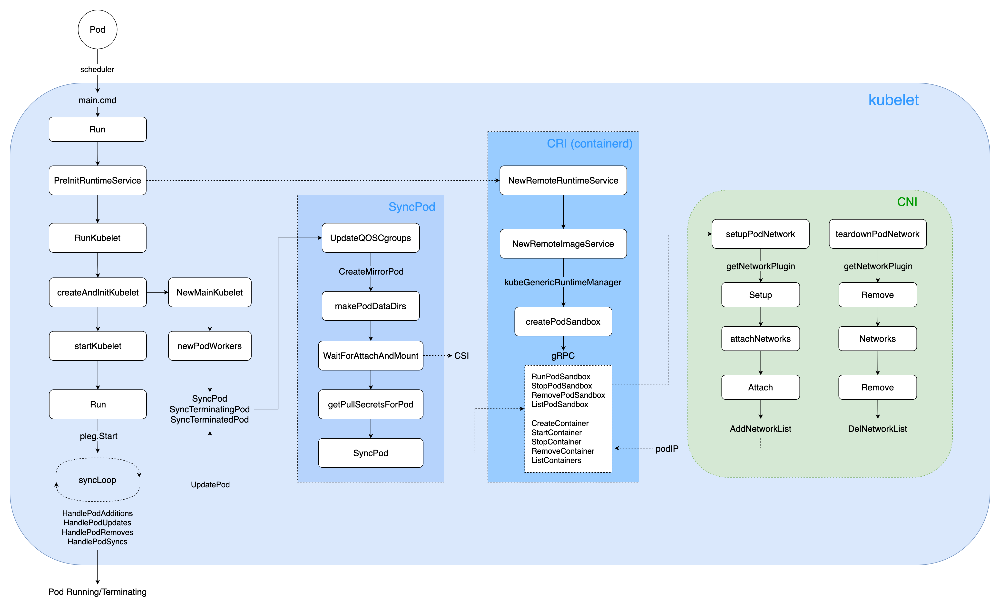

# K8s Pod IP 分配机制
> 参考
https://github.com/k8s-club/k8s-club/blob/main/articles/K8s%20Pod%20IP%20%E5%88%86%E9%85%8D%E6%9C%BA%E5%88%B6.md
https://kubernetes.io/zh-cn/docs/concepts/cluster-administration/networking/


## 概述
Pod 初始化核心流程如下：
- kube-apiserver 收到客户端请求（Controller 或 kubectl 客户端）后，创建对应的 Pod；
- kube-scheduler 按照配置的调度策略进行 Pod 调度，选择最为合适的 Node 作为目标节点；
- kubelet（运行于每个 Node 上的 K8s agent）Watch 监听到调度到所在节点的 Pod(s)，开始真正创建 Pod；
- **由 CRI 首先创建出 PodSandbox，初始化对应的网络 net namespace，调用 CNI 获取 Pod IP**；
- **接着 CRI 开始创建 Pod 中第一个 pause container，绑定到上一步创建的 net namespace 和 Pod IP**；
- 接着由 CRI 依次创建和启动 Pod 中声明的 initContainers 和 containers 容器；
- 当所有的 containers 运行起来后，探针探测容器运行符合预期后，Pod 状态最终更新为 Running；

## K8S中的IP
### Pod IP CIDR
初始化k8s集群时，`--cluster-cidr`参数控制Pod IP CIDR 网段。
如`10.0.0.0/16`，理论上最大支持 2 ^ (32 - 16) = 65536 个 Pod IP 的分配。
网络插件配置为 Pod 分配具体的 IP 地址。
> 【集群规模】可按需配置 Pod IP CIDR，K8s 官方支持的一个大集群（large cluster），最大支持约 5k Nodes、15w Pods。

### Node CIDR
集群中每个 Node 分配一个 subnet CIDR，他们都属于 `--cluster-cidr` 网段。
参数控制：kubelet 或 cloud-controller-manager通过 `kube-controller-manager` 组件的 `--allocate-node-cidrs=true`、`--node-cidr-mask-size=24` 参数控制每个 Node 节点的 subnet CIDR 子网段，这样落在每个 Node 上的 Pod 最大的可分配 IP 数量为 2 ^ (32 - 24) = 256 个，各云厂商会根据自己的网络策略，一般会预留一部分，最终可分配的 IP 一般为最大个数的一半 (128 个)
> 在 K8s 标准集群中，通过 kubelet 组件的 --max-pods=110 控制了默认一个 Node 最大的 Pod 数量为 110 个。

### Service IP CIDR
控制 Service 资源的 ClusterIP 网段范围。除了`Headless Service`显式设置`.Spec.cludterIP=None`，生成的 Service 将不会分配 ClusterIP，其他类型的 Service 则都会动态分配 ClusterIP。
参数控制：通过 `kube-apiserver` 和 `kube-controller-manager` 组件的 `--service-cluster-ip-range=10.96.0.0/12` 控制 Service ClusterIP 的网段范围。

## Pod 生命周期
### Pod 类型及创建方式
#### Static Pod
在Kubernetes集群中除了我们经常使用到的普通的 Pod 外，还有一种特殊的 Pod，叫做`Static Pod`。
`静态 Pod` 直接由特定节点上的kubelet进程来管理，不通过 master 节点上的apiserver，直接由 kubelet 管理。通常用于启动和维护节点上关键的系统组件。如 `etcd`、`kube-apiserver`、`kube-scheduler` 和 `kube-controller-manager`。

> 这种方式也为我们将集群的一些组件容器化提供了可能，因为这些 Pod 都不会受到 apiserver 的控制，不然我们这里kube-apiserver怎么自己去控制自己呢？万一不小心把这个 Pod 删掉了呢？所以只能有kubelet自己来进行控制，这就是我们所说的静态 Pod。

kubelet会自动为每一个`静态 pod` 在 `Kubernetes` 的 `apiserver` 上创建一个`MirrorPod`镜像 Pod提交到 kube-apiserver，因此我们可以在 `apiserver` 中查询到该 pod【`kubectl get pod` 】，但是不能通过 `apiserver` 进行控制（例如不能删除）。
> 【mirrorPod】表示通过 staticPod 方式由 kubelet 拉起来的 Pod，kubelet 会统一发起 Pod.Create() 请求，写到 kube-apiserver，这样通过 kubectl 客户端就可以查看了。

> mirrorPod 的 name 后缀统一为所在 Node hostname（如 mirror-pod-10.0.0.6），如果直接通过 kubectl delete pod 删除后，又会被 kubelet 立即拉起来。


#### 创建方式
三种创建 Pod 的方式：`staticPodPath-file`, `staticPodURL-http`, `kube-apiserver`
- `kube-apiserver`：最常见的方式，包括通过 `kubectl apply -f xxx.yaml` 和各类 Controller 动态创建的 Pod 都是这种类型。
- `staticPodPath-file`：创建那些核心组件的staticPod，默认路径是 `/etc/kubernetes/manifests` 目录，**kubelet 会持续监听此目录**，有对应 yaml 变更时，动态变更对应的 staticPod
- `staticPodURL-http`：通过 kubelet 参数 --manifest-url 指定的 HTTP 方式，创建对应 URL 指定的一个或多个 Pod，这种方式实际场景较少使用。

### kubelet 管理 Pod 生命周期

kubelet核心流程：
- kubelet ListAndWatch 监听到调度器所在的节点的Pod，开始真正创建Pod；
- 由`CRI`首先创建出`PodSandbox`，初始化对应的网络`net namespace`，调用`CNI`获取`Pod IP`；
- 接着`CRI`开始创建Pod中第一个`pause container`，绑定到上一步创建的`net namespace`和`Pod IP`；
- 接着由 `CRI` 依次创建和启动 Pod 中声明的 `initContainers` 和 `containers` 容器；
- 当所有的 containers 运行起来后，`探针`探测容器运行符合预期后，Pod 状态最终更新为 `Running`；


## Pod IP 分配流程
### CNI-IPAM 分配 IP
通过 CNI 官网 可查看当前支持的多种插件，分为 `Main`, `Meta`, `IPAM` 等多种类型，其中 IPAM (IP Address Management) 是专门进行 IP 地址分配的插件，支持三种子类型 `dhcp`, `host-local`, `static`。
- `dhcp`：是通过 dhcp client 请求 dhcp server 服务进行动态 IP 分配，其依赖 CNI 插件可访问 dhcp 服务器，配置复杂度高，实际使用较少。
- `host-local`：是最常见的使用方式，通过在宿主机 Node 上以文件读写的方式，进行 IP 分配与释放。其中 IP 可分配的 range 范围由上面 所述，通过 Controller 为每一个 Node 分配对应的 CIDR，**host-local 插件将从这个 Node CIDR 中动态分配 IP 给 Pod 使用**。
- `static`：是通过直接指定 IP 地址，为 Pod 分配指定的 IP

## Pod IP 固定与回收
K8s 中通过 `StatefulSet` 实现有状态服务的管理，其生成的 Pod 编号 (如 mysql-0, mysql-1, mysql-2) 是**唯一且重建后不变**。
> 某些业务场景下，业务上层需要对应的 Pod IP 保持不变，这样在 Pod 异常后快速拉起，上层业务不需要变更 IP 就可以自动恢复。因此这种场景就需要 Pod IP 在重建前后保持一致。

在 Pod 被删除后，还可以指定 Pod IP 的保留时长，防止短时间新创建的 Pod 复用了最近被删除 Pod 的 IP，很容易给上层业务造成困扰与异常，造成业务的不稳定。因此用户或各大云厂商可通过设计与实现 Pod 的固定与定时回收机制满足有状态服务的固定 IP 需求。

### 实现思路
在创建 Pod 时记录某个 `StatefulSet` 下对应 `namespace/podName` 与 `ReservedIP` 的映射关系，当此 `namespace/podName` 删除时，仅仅记录 `ReservedIP` 的 TTL。在 TTL 过期之前，再次创建同名的 namespace/podName，则直接用之前保留的 Pod IP。若 TTL 已过期，则由对应的 GC 逻辑去真正调用 `CNI IPAM plugin`，删除对应的 Pod IP。

在 Pod Annotations 加上下面的设置即可：
```yaml
apiVersion: v1
kind: Pod
metadata:
  name: fixed-pod-ip
  annotations:
    cni.projectcalico.org/ipAddrs: "[\"192.168.0.1\"]"
spec:
  ...
```