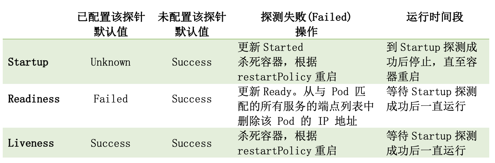

# 探针
> 参考
https://www.cnblogs.com/l-hh/p/14848256.html
https://kubernetes.io/zh-cn/docs/tasks/configure-pod-container/configure-liveness-readiness-startup-probes/
https://github.com/k8s-club/k8s-club/blob/main/articles/Kubelet%20-%20Probe%20%E6%8E%A2%E9%92%88.md

## 概念
探测一个对象的运行情况
## 为什么需要探针？
- 避免慢启动容器被错杀
- 捕捉服务死锁
- 可用性检测
- 存活性检测
- ...
> 一个实际的例子：
我们期望运行一个数据库 mysql 的 Deployments(replicas=1)，并在 mysql 可提供服务的第一时间检测到，从而方便我们后续使用。 此时，简单的想法是直接检测对应 container 是否为 running，从而得到对应服务是否可用的结果。
在对服务的准确性和可靠性要求没有那么高的场景下，这或许是可行的。 但是严格来说，container 处于 running 状态，并不一定表明 mysql 服务是可用的。因为容器环境准备好之后，到 mysql 服务起来，再到真正能够提供服务之间还有一定的时间间隔。 并且我们不能保证在这个时间，服务能够顺利平稳的起来。比如：最简单的数据库用户名或密码出错、权限不够等等，导致服务启动失败。 因此我们需要借助探针来感知 mysql 服务是否真正起来了，并且在 mysql 提供服务的过程中，去定期探测服务是否可用，从而保证服务的高可用。

## k8s里的内部探针
- 支持三类探针：`startupProbe`启动探针、`readinessProbe`就绪探针、`livenessProbe`存活探针
- 支持三种探测方式：`Http`、`Tcp`、`Exec`
- k8s中具体执行/管理探针的 manager 位于 kubelet（probeManager）。kubelet在每一个node上都有一个
- 同一个pod的同一个container下同类型(startup、readiness、liveness)的探针有且仅有一个。
- 在配置了`Startup探针`之后，只有startup探针`Success`之后，其余类型的探针才会开始工作
- 在容器Started之后，`Readiness`、`Liveness`探针会一直工作，但是`Startup`会停止直至重启

## 如何配置与使用探针
细节参见官网 Configure Liveness, Readiness and Startup Probes
https://kubernetes.io/zh-cn/docs/tasks/configure-pod-container/configure-liveness-readiness-startup-probes/

一些配置参数的解释：
- `PeriodSeconds`: 多久进行一次探测，默认为10s，最小为1s，单位为秒(s)
- `InitialDelaySeconds`: 在contaienr创建好之后进行初次探测需要延迟的时间
- `SuccessThreshold`: 最小的连续成功阈值，只有连续成功阈值次之后，探测结果才为成功，默认为1，最小为1。对于liveness和startup只能设置为1
- `TerminationGracePeriodSeconds`: 在探测失败之后，留多少时间给pod来gracefully shutdown，单位为秒(s)，最小为0，表示立即shutdown，一点都不优雅-_-。说明：pod的spec.terminationGracePeriodSeconds也是这个意义，但是探针的这个属性比pod的优先级要高，也就是说只有探针没有配置该值时，才会使用pod设置的值。说明：这个参数在之前的版本中没有喔～

## 检查机制
### exec
在容器内执行指定命令。如果命令退出时返回码为 0 则认为诊断成功。

> exec 探针的实现涉及每次执行时创建/复制多个进程。 因此，在集群中具有较高 pod 密度、较低的 initialDelaySeconds 和 periodSeconds 时长的时候， 配置任何使用 exec 机制的探针可能会增加节点的 CPU 负载。 

### grpc
使用 gRPC 执行一个远程过程调用。 目标应该实现 gRPC 健康检查。 如果响应的状态是 "SERVING"，则认为诊断成功。

### httpGet
**对容器的 IP 地址上指定端口和路径执行 HTTP GET 请求**。如果响应的状态码大于等于 200 且小于 400，则诊断被认为是成功的。

### tcpSocket
对容器的 IP 地址上的指定端口执行 TCP 检查。如果端口打开，则诊断被认为是成功的。 如果远程系统（容器）在打开连接后立即将其关闭，这算作是健康的。

## 三类探针
- `Liveness探针`为`Success`并不一定表示服务可用，但是`Failed`一定表示服务不可用
- `Readiness探针`为`failed`并不一定表示服务不可用，但是`Success`一定表示服务可用


### `startupProbe`
**kubelet 使用启动探针来了解应用容器何时启动**。 如果配置了这类探针，存活探针和就绪探针成功之前不会重启，确保这些探针不会影响应用的启动。 启动探针可以用于对慢启动容器进行存活性检测，避免它们在启动运行之前就被杀掉。

Startup探针会去更新ContainerStatus中的Started字段，若没有配置Starup探针，那么Started字段默认为true。
Started探针默认探测结果为Unknown，表明初始不知道服务有没有起来。如果探测到Failed，会杀死容器，根据restartPolicy来重启容器。
**Startup探针在容器启动完成（containerStatus.Started）之后就会停止探测行为，直到出现重启（restart）情况**。如果探测失败，会杀死容器，并根据restartPolicy来重启。

#### 示例

#### 场景使用
> 场景：慢启动容器。某应用程序启动时间比较长，在5min内起来都是正常情况，但是超过5分钟就认为该服务失败了。此时，如果只配置了Readiness和Liveness探针，就有可能导致服务正在启动中，但是被Liveness判定为Faialed，从而错杀，导致反复重启。这种情况下可以使用startup探针，设置periodSecond为5，failureThreshold为60,那么该服务最多有5*60=300s，也即时5min的时间来执行启动过程。

### `livenessProbe`
**kubelet 使用存活探针来确定什么时候要重启容器**。 
`Liveness`探针默认探测结果为Success，说明默认服务存活。一旦检测到`Failed`，会杀死容器，并根据restartPolicy来**重启容器**。

#### 场景使用
> 场景：**应用程序死锁**。某个一直在提供服务的节点，因为某次请求进入了死锁，此时如果配置了Readiness探针会将该服务踢出LB，但是该服务永远不会回来了，此时就需要配置Liveness探针，将该容器杀死并重启，并根据restartPolicy来重启。

#### 示例
1. exec方式
```yaml
apiVersion: v1
kind: Pod
metadata:
  labels:
    test: liveness
  name: liveness-exec
spec:
  containers:
  - name: liveness
    image: registry.k8s.io/busybox
    args:
    - /bin/sh
    - -c
    - touch /tmp/healthy; sleep 30; rm -f /tmp/healthy; sleep 60
    # 创建 /tmp/healthy 文件，休眠30秒，删除 /tmp/healthy 文件，再休眠 1 分钟。
    livenessProbe:
      exec: # 执行命令 cat /tmp/healthy 来进行探测。 如果命令执行成功并且返回值为 0，kubelet 就会认为这个容器是健康存活的
        command:
        - cat
        - /tmp/healthy
      initialDelaySeconds: 5 # kubelet 在执行第一次探测前应该等待 5 秒
      periodSeconds: 5 # kubelet 应该每 5 秒执行一次存活探测
```
这个容器生命的前 30 秒，/tmp/healthy 文件是存在的。 所以在这最开始的 30 秒内，执行命令 cat /tmp/healthy 会返回成功代码。 30 秒之后，执行命令 cat /tmp/healthy 就会返回失败代码。

2. HTTP 请求接口 

```yaml
apiVersion: v1
kind: Pod
metadata:
  name: readiness-httpget   # Pod 名称
  namespace: test           # Pod 所在的命名空间
spec:
  containers:
  - name: readiness-httpget-container       # 容器名称
    image: hub.test.com/library/mynginx:v1  # 镜像地址
    imagePullPolicy: IfNotPresent           # 镜像下载策略
    readinessProbe:             # 就绪探测
      httpGet:                  # 检测方案
        path: /index1.html      # 检测路径
        port: 80                # 检测端口
      initialDelaySeconds: 3    # 启动后多少秒开始第一次检测
      periodSeconds: 3          # 每次间隔检测时间
```
> 实际就是检测：http://localhost/index1.html，是否正常。

虽然已经 Running 了，但是还没就绪状态，因为我们这个容器没有index1.html这个页面。 describe发现 提示就绪检测找不到该页面，返回状态码 404
进入该容器手动创建index1.html页面
```bash
[root@k8s-master01 ~]# kubectl exec readiness-httpget -n test -it -- /bin/bash
root@readiness-httpget:/# cd /usr/share/nginx/html/
root@readiness-httpget:/usr/share/nginx/html# ls
50x.html  index.html
root@readiness-httpget:/usr/share/nginx/html# touch index1.html 
root@readiness-httpget:/usr/share/nginx/html# exit
```
再次查看 Pod 状态已经就绪状态了

3. TCP
```yaml
apiVersion: v1
kind: Pod
metadata:
  name: goproxy
  labels:
    app: goproxy
spec:
  containers:
  - name: goproxy
    image: registry.k8s.io/goproxy:0.1
    ports:
    - containerPort: 8080
    readinessProbe: # 探针会尝试连接 goproxy 容器的 8080 端口。 如果探测成功，这个 Pod 会被标记为就绪状态
      tcpSocket:
        port: 8080
      initialDelaySeconds: 15
      periodSeconds: 10
    livenessProbe:
      tcpSocket:
        port: 8080
      initialDelaySeconds: 15
      periodSeconds: 20
```

4.  gRPC
如果你的应用实现了 gRPC 健康检查协议， kubelet 可以配置为使用该协议来执行应用存活性检查。 你必须启用 GRPCContainerProbe 特性门控 才能配置依赖于 gRPC 的检查机制。
```yaml
apiVersion: v1
kind: Pod
metadata:
  name: etcd-with-grpc
spec:
  containers:
  - name: etcd
    image: registry.k8s.io/etcd:3.5.1-0
    command: [ "/usr/local/bin/etcd", "--data-dir",  "/var/lib/etcd", "--listen-client-urls", "http://0.0.0.0:2379", "--advertise-client-urls", "http://127.0.0.1:2379", "--log-level", "debug"]
    ports:
    - containerPort: 2379
    livenessProbe:
      grpc:
        port: 2379
      initialDelaySeconds: 10
```

### `readinessProbe`
**kubelet 使用就绪探针可以知道容器何时准备好接受请求流量**，当一个 Pod 内的所有容器都就绪时，才能认为该 Pod 就绪。 这种信号的一个用途就是控制哪个 Pod 作为 Service 的后端。 若 Pod 尚未就绪，会被从 Service 的负载均衡器中剔除。

`Readiness`探针会去更新ContainerStatus中的`Ready`字段，没有配置`Readiness`探针默认`Ready`字段为`true`。Readiness探针默认探测结果为Failed。

#### 场景使用
> 场景：期望在1个LB（LoadBalance）下挂3个无状态服务节点，但是，我们希望只有在节点可以提供服务之后才开始接收请求处理。避免出现LB将请求打到未准备好的服务之上，从而出现500服务不可用的报错。此时我们可以配置Readiness探针，只有在readiness探测到成功之后，才将服务挂到LB之上，从而保证整个服务一直都是稳定高可用的。

#### 示例

## 探针源码剖析
探针的执行由kubelet来管理