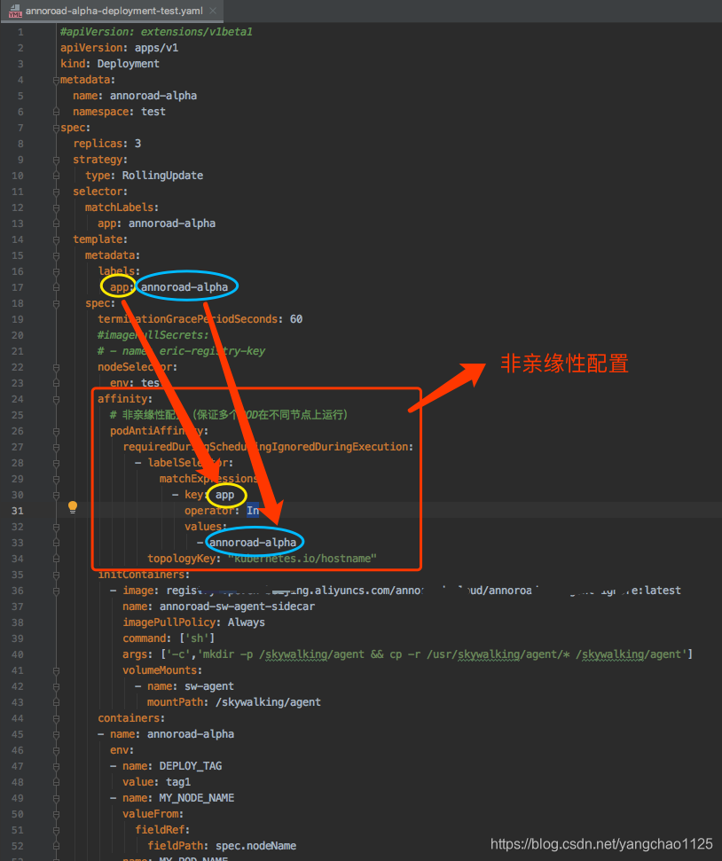

https://kubernetes.io/zh-cn/docs/concepts/scheduling-eviction/kube-scheduler/
# kube-scheduler 
是 Kubernetes 集群的默认调度器，并且是集群 控制面 的一部分。
作用：在k8s集群中为一个Pod资源对象找到合适的节点

## 架构
kube-scheduler 给一个 Pod 做调度选择时包含两个步骤：
1. 过滤 `Filtering`。将所有满足 Pod 调度需求的节点选出来。在过滤之后，得出一个节点列表，里面包含了所有可调度节点，如果这个列表是空的，代表这个 Pod 不可调度。
2. 打分 `Scoring`。调度器会为 Pod 从所有可调度节点中选取一个最合适的节点。 根据当前启用的打分规则，调度器会给每一个可调度节点进行打分。将 Pod 调度到得分最高的节点上。

配置调度器的过滤和打分行为：
- Kubernetes v1.23 版本之前，可以使用调度策略来指定 `predicates` 和 `priorities` 进程。
- 通过编写**配置文件**，并将其路径传给 kube-scheduler 的命令行参数，定制 kube-scheduler 的行为。

### 实例化Scheduler对象
1. 实例化所有的`Informer`：如NodeInformer、PodInformer、PresistentVolumeInformer等
2. 实例化调度算法函数
3. 为所有`Informer`对象添加资源事件的监控

## 优先级与抢占机制
根据Pod资源对象的`优先级priority`进行调度，高优先级的Pod资源对象排在`调度队列SchedulingQueue`前面，优先获得合适的节点。
如果一个 Pod 无法被调度，调度程序会尝试`抢占preempt`（驱逐）较低优先级的 Pod， 以使悬决 Pod 可以被调度。

`PriorityClass` 是一个无命名空间对象，它定义了从优先级类名称到优先级整数值的映射。value字段值越高表示优先级越高
```yaml
apiVersion: scheduling.k8s.io/v1
kind: PriorityClass
metadata:
  name: high-priority
value: 1000000
globalDefault: false #表示此PriorityClass是否应用于没有PriorityClassName字段的Pod，整个k8s中只能一个设置为true
description: "此优先级类应仅用于 XYZ 服务 Pod。"
```
**非抢占式 PriorityClass**：添加字段`preemptionPolicy: Never`
为Pod资源对象设置优先级，在`PodSpec.PriorityClassName`中添加

## 亲和性调度
### 节点亲和性
`NodeAffinity`将某个Pod资源对象调度到特定的节点上

两种调度策略：
- `RequiredDuringSchedulingIgnoredDuringExecution`/`Hard策略`：Pod资源对象**必须被部署到满足条件的节点上**，如果没有满足条件的节点，则Pod资源对象创建失败不断重试。字段在v1.14版本被注释了，不建议使用
- `PreferresDuringSchedulingIgnoredDuringExecution`/`Soft策略`：Pod资源对象**优先被部署到满足条件的节点上**，如果没有满足条件的节点，则从其他节点中选择较优的节点。

### Pod资源对象亲和性
`PodAffinity`：将某个Pod资源对象调度到与另一个Pod资源对象相邻的位置，如调度到同一主机，调度到同一硬件集群，以缩短网络传输时延。
同样支持上述两种调度策略。

### Pod资源对象反亲和性
`PodAntiAffinity`一般用于容灾。如将一个Pod资源对象的多副本实例调度到不同节点上，调度到不同的硬件集群上。
例，将Deployment的多个副本部署到不同的节点上：

```yaml
apiVersion: v1
kind: Pod
metadata:
  name: with-pod-affinity
spec:
  affinity:
    podAffinity: # 节点亲和性 利用Pod亲和性，将Pod部署到相关联的Pod目前所在的节点
      requiredDuringSchedulingIgnoredDuringExecution:
      - labelSelector: # 标签选择算符 
          matchExpressions:
          - key: security
            operator: In
            values:
            - S1
        topologyKey: kubernetes.io/hostname # 拓扑域 其取值是系统用来标示域的节点标签键，可以使用这个字段来决定 pod 不能被调度到同一个机柜、可用性区域、地域
    podAntiAffinity: # 利用Pod反亲和性，将不同副本部署到不同节点上
      preferredDuringSchedulingIgnoredDuringExecution:
      - weight: 100
        podAffinityTerm:
          labelSelector: # 不能部署到拥有标签 security=S2所在的节点上，也就是其他副本所在的节点。
            matchExpressions:
            - key: security
              operator: In
              values:
              - S2
          topologyKey: kubernetes.io/hostname
  containers:
  - name: with-pod-affinity
    image: registry.k8s.io/pause:2.0

```

## 内置调度算法
默认提供了两类调度算法：
- 预选调度算法 `Filtering`。检查节点是否符合运行“待调度Pod资源对象”的条件，如果符合加入可用节点列表。
- 优选调度算法 `Scoring`。根据当前启用的打分规则，调度器会给每一个可用节点进行打分。将 Pod 调度到得分最高的节点上。

### 预选调度算法
- 检查节点是否就绪
- 检查节点上Pid资源对象数量的上限，以及CPU GPU 内存等资源是否符合要求
- 检查当前Pod资源对象使用的卷是否与节点上其他Pid资源对象使用的卷冲突
- 检查Pod资源对象是否能容忍Node Taints污点。可以在 Pod spec.tolerations中为 Pod 设置容忍度。
- 检查节点是否满足Pod资源对象的PVC挂载需求
- 检查是否符合亲和性规则
- 检查是否可以调度到有MemoryPressure的节点上 
等

### 优选调度算法
每种优选调度算法都实现基于`Map-Reduce`的方式对节点计算分数，分两步：
- Priority Map：计算节点分数。在0-10之间。
- Priority Reduce：汇总每个节点的分数并根据权重值计算节点最终分数。每种优选调度算法都有一个权重值。

优选调度算法：
- 基于亲和性、反亲和性计算分数
- 计算Pod资源所需CPU内存占当前节点可用资源的百分比，百分比最小的最优
- 基于污点和容忍度是否匹配计算分数
- 基于节点是否下拉了Pod镜像

## 核心实现
### 调度周期和绑定周期
调度周期和绑定周期一起被称为“调度上下文”。
- 调度周期`scheduling cycle`：为 Pod 选择一个节点
- 绑定周期`binding cycle`： 将该决策应用于集群

调度周期是串行运行的，而绑定周期可能是同时运行的。无需等待bind操作即可进行下一轮的调度周期。

如果确定 Pod 不可调度或者存在内部错误，则可以终止调度周期或绑定周期。 Pod 将返回队列并重试。
