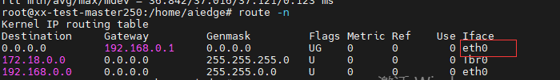
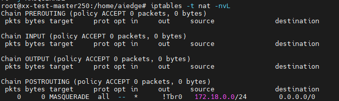

https://www.lixueduan.com/posts/docker/10-bridge-network/
https://github.com/mz1999/blog/blob/master/docs/docker-network-bridge.md
《自己动手写Docker》
# network namespace

# 网络虚拟化技术
## veth 
Veth 是成对出现的虚拟网络设备 发送 Veth 一端虚 设备 请求会 另一端
备中发出。在容器的虚拟 场景中，经常会使 Veth 连接不同的网络Namespace

## Linux bridge
Bridge 虚拟设备是用来桥接的网络设备，它相当于现实世界中的交换机 可以连接不同的网络设备，当请求到达 Bridge 设备时，可以通过报文中的 Mac 地址进行广播或转发。例如，创建 Bridge 设备，来连接 Namespace 中的网络设备和宿主机上的网络

## 实验

通过 Linux 提供的各种虚拟设备以及 iptables 模拟出了 Docker bridge 网络模型，并测试了几种场景的网络互通
仅仅创建出Namespace网络隔离环境来模拟容器行为：
https://www.lixueduan.com/posts/docker/10-bridge-network/

1. 创建“容器”
```bash
sudo ip netns add Tdocker0
sudo ip netns add Tdocker1
```
查看创建出的网络Namesapce：


2. 创建Veth pairs
```bash
sudo ip link add Tveth0 type veth peer name Tveth1
sudo ip link add Tveth2 type veth peer name Tveth3
```
查看创建出的Veth pairs：

将Veth一端放入容器：
```bash
sudo ip link set Tveth0 netns Tdocker0
sudo ip link set Tveth2 netns Tdocker1
```

进入容器Tdocker0查看网卡：发现Tveth0已经放入了“容器”Tdocker0内，并且可以看出与index为7的是一组veth pair

在宿主机上查看网卡ip addr，发现veth0和veth2已经消失，确实是放入“容器”内了。

3. 创建bridge
安装bridge管理工具brctl `sudo apt-get install bridge-utils`
创建网桥`sudo brctl addbr Tbr0`
将Veth的另一端接入bridge 
```bash
sudo brctl addif Tbr0 Tveth1
sudo brctl addif Tbr0 Tveth3
```
查看效果`sudo brctl show`

两个网卡Tveth1和Tveth3已经“插”在bridge上。

4. 为"容器“内的网卡分配IP地址，并激活上线【意味着网络接口卡（网卡）已经被启用，并且已经连接到网络，可以开始发送和接收数据。】
新创建的netns里只有lo网卡：

```bash
 sudo ip netns exec Tdocker0 ip a add 172.18.0.2/24 dev Tveth0
 sudo ip netns exec Tdocker0 ip link set Tveth0 up
 ```

同样在Tdocker1中执行：
```bash
sudo ip netns exec Tdocker1 ip addr add 172.18.0.3/24 dev Tveth2
sudo ip netns exec Tdocker1 ip link set Tveth2 up
```


5. Veth另一端的网卡激活上线
`sudo ip link set Tveth1 up`
`sudo ip link set Tveth3 up`

6. 为bridge分配IP地址，激活上线
```bash
sudo ip addr add 172.18.0.1/24 dev Tbr0
sudo ip link set Tbr0 up
```


目前的网络拓扑图：


场景一： 容器”间的互通测试
`sudo ip netns exec Tdocker0 ping -c3 172.18.0.3`

可以设置监听网桥Tbr0:

同样，从容器Tdocker1 ping 容器Tdocker0也是通的：


场景二：从宿主机访问“容器”内网络


从宿主机访问“容器内部”，经过网桥


场景三：从“容器”内访问外网
此时，容器内部：

因此，访问外网（百度）是不可达的


因此需要修改规则
- 将bridge设置为“容器”的缺省网关：
```bash
sudo ip netns exec docker0 route add default gw 172.18.0.1 veth0
sudo ip netns exec docker1 route add default gw 172.18.0.1 veth2
```
查看“容器”内的路由表：

可以看出，“容器”内的缺省Gateway是bridge的IP地址，非172.18.0.0/24网段的数据包会路由给bridge。
- 发现是外部网络，走eth0


- 配置iptables的SNAT规则
如果它要访问外网，需要在数据包离开前将源地址替换为宿主机的IP，这样外部主机才能用宿主机的IP作为目的地址发回响应。

    - 确认系统的 IP 转发是否已打开 `sysctl net.ipv4.ip_forward=1`
    - SNAT规则
`iptables -t nat -A POSTROUTING -s 172.18.0.0/24 ! -o Tbr0 -j MASQUERADE`
在nat表的POSTROUTING链增加规则，当数据包的源地址为172.18.0.0/24网段，输出接口不是Tbr0时，就执行MASQUERADE动作。


- 从“容器”内访问外部地址


场景四：从外部访问“容器”内暴露的服务
- 配置iptables的DNAT规则
`iptables -t nat -A PREROUTING ! -i Tbr0 -p tcp -m tcp --dport 80 -j DNAT --to-destination 172.18.0.2:80
` 在nat表的PREROUTING链增加规则，当输入设备不是Tbr0，目的端口为80时，做目的地址转换，将宿主机IP替换为容器IP。


- 从远程访问“容器”内暴露的服务
在“容器”docker0内启动服务：`sudo ip netns exec Tdocker0 nc -lp 80`【netcat在本地监听端口 80】
在和宿主机同一个局域网的远程主机访问宿主机IP:80 `telnet 192.168.20.250 80`


### 测试环境恢复
删除虚拟网络设备
```bash
sudo ip link set Tbr0 down
sudo brctl delbr Tbr0
sudo ip link  del Tveth1
sudo ip link  del Tveth3
```
iptablers和Namesapce的配置在机器重启后被清除。
# iptables

# docker容器网络
docker的4种网络模式
bridge模式
container模式
host模式
none模式
# 跨主机容器网络