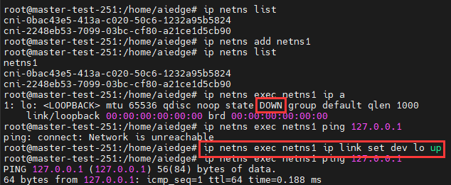
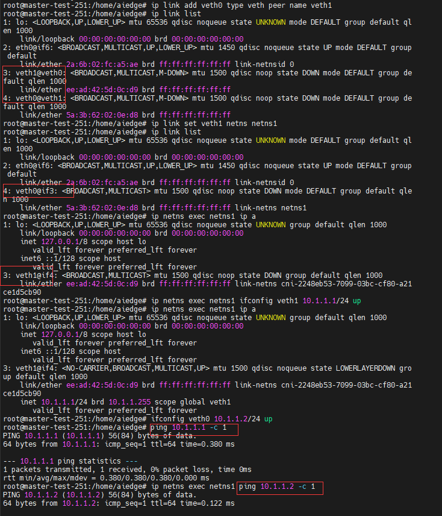

# 容器网络

> 参考链接：https://blog.csdn.net/qq_40378034/article/details/123599477
>
> https://blog.csdn.net/qq_40378034/article/details/123964705
>
> 《k8s网络权威指南》

# Docker 网络原理
docker 4种网络模型：bridge ，host , none , container。默认网络模型 bridge

## 前置知识

### network namespace

**作用**：隔离linux 系统的设备，ip 地址，端口，路由表，防火墙等网络资源。

**`network namespace`的增删改查 集成到 linux 的 ip 工具`netns`命令中**。涉及系统调用 `clone`，`unshare`，`setns`
- `ip netns add netns1`创建名为netns1的network namespace，此时系统会在`/var/run/netns`路径下生成一个挂载点。此时，会附带创建一个本地回环地址。除此之外，没有任何其他的网络设备。
- `ip netns exec netns1 ip link list`进入net ns，做网络查询。
- `ip netns list`查看系统中有哪些net ns
- `ip netns delete netns1`移除了这个network namespace对应的挂载点，只要里面还有进程运行着，network namespace便会一直存在
访问本地回环地址：
- `ip netns exec netns1 ip link set dev lo up`将lo设备启起来

与外界（主机上的网卡）通信
在namespace里再创建一对虚拟的以太网卡，即所谓的veth pair。（详细见下节 ### veth pair）
- `ip link add veth0 type veth peer name veth1`创建一对虚拟以太网卡，此时两端都在主机的netns中。然后把veth pair的一端放到netns1 network namespace。`ip link set veth1 netns netns1`
- `ip netns exec netns1 ifconfig veth1 10.1.1.1/24 up`进入netns1，为veth1绑定IP地址10.1.1.1/24，并把网卡的状态设置成UP。`ifconfig veth0 10.1.1.2/24 up`主机的一端veth0被我们绑定了IP地址10.1.1.2/24，并把网卡的状态设置成UP


#### PID

network namespace 有两种途径索引：名字、**属于该namespace的进程PID**。

```bash
ip netns exec netns1 ip link set veth1 netns 1
# 进入netns1，把veth1网卡挪到PID:1 的进程（即init进程）所在的network namespace
```

PID:1 的进程（即init进程）所在的network namespace就是：主机根network namespace 

`/proc/PID/ns`目录下的文件代表一个类型的namespace，每个文件都是一个符号链接文件。**打开文件描述符（如挂载操作）就能保持namespace存在**

eg. /proc/1/ns


```bash
ip netns exec netns1 /bin/bash
```

上述命令实质：

```c
fd=open(argv[1],O_RDONLY);# 获取namespace文件描述符
setns(fd,0); # 加入namespce
execvp(argv [2],&argv [2]) # 执行用户自定义程序
    
#入参 /var/run/netns/netns1 /bin/bash
```


#### 创建

```bash
# 创建名为netns1的network namespace
sudo ip netns add netns1
```

创建时，系统会在`/var/run/netns/`路径生成挂载点。（使得没有进程运行也能继续存在）

```bash
# 进入netns
sudo ip netns exec netns1 sh
```

初始创建，有一个lo本地环回设备。如下，初始是 `Down`状态。


```bash
 ip link set dev lo up
```


#### clone

**使用`clone`系统调用创建namespace**

`clone`用于创建一个新的进程，并可以选择性地与父进程共享或分离多个资源，包括进程空间、文件系统、信号处理等。

```c
#include <sched.h>

int clone(int (*fn)(void *), void *child_stack, int flags, void *arg, ...);
```

- fn：指向子进程要执行的函数的指针。该函数应该具有 int 类型的返回值，接受一个 void* 类型的参数。

- child_stack：指向子进程栈的指针。子进程会在一个新的栈空间中执行，child_stack 指向该栈的顶部。栈应该是独立分配的，并且具有足够的空间来容纳子进程执行所需的栈帧。

- flags：用于指定创建子进程时的行为和资源共享方式的标志位，可以使用以下标志的按位或运算进行组合：

  > CLONE_CHILD_CLEARTID：子进程在调用exec函数或退出时，会将tid置为0。
  > 	CLONE_CHILD_SETTID：子进程在调用exec函数或退出时，会将tid置为子进程ID。
  > 	CLONE_FILES：子进程与父进程共享文件描述符表。
  > 	CLONE_FS：子进程与父进程共享文件系统信息。
  > 	CLONE_IO：子进程与父进程共享I/O上下文。
  > 	CLONE_NEWIPC：子进程创建一个新的IPC命名空间。
  > 	**CLONE_NEWNET：子进程创建一个新的网络命名空间。**
  > 	CLONE_NEWNS：子进程创建一个新的挂载命名空间。
  > 	CLONE_NEWPID：子进程创建一个新的PID命名空间。
  > 	CLONE_NEWUTS：子进程创建一个新的UTS命名空间。

- arg：传递给子进程函数的参数。

#### 其他命令

```bash
# 列出所有
ip netns list
# 删除
ip netns delete netns1 #至十一除了这个netns的挂载点，只要里面还有进程运行，netns便会存在
```


### veth pair
veth是**虚拟以太网卡（Virtual Ethernet）**的缩写。veth设备总是成对的，因此称之为veth pair。veth pair一端发送的数据会在另外一端接收。

常用于跨namespace之间的通信。两端放入不同的namespace里。

原理：**向veth pair 设备一端输入数据**，数据通过内核协议栈**从veth pair 另一端出来。**


```bash
# 创建veth0-veth1一对veth pair 。veth0放本机，veth1方ns2
ip link add veth0 type veth peer name veth1
ip link set veth1 netns netns2
# 设置状态UP
ip netns exec netns2 ifconfig veth1 10.1.1.1/24 up
ifconfig veth0 10.1.1.2/24 up
```

此时，可以ping通veth pair的任意一头，在主机上ping 10.1.1.1 。进入netns1去ping 10.1.1.2

数字是veth pair的index，一头是4另一头是3

### Linux bridge

两个network namespace可以通过veth pair连接，但要做到两个以上network namespace相互连接，veth pair就做不到了，而通过Linux bridge就可以实现

**网桥是二层网络设备。**Linux bridge 行为更像一台虚拟的网络交换机，不能跨机连接网络设备。有多个端口，数据可以从任何端口进来，进来之后从哪个口出取决于目的MAC地址。

连接在网桥上的网络设备收到的数据只会无条件交给网桥处理。


```bash
[root@aliyun ~]# apt install  bridge-utils

# 创建网桥
[root@aliyun ~]# brctl addbr br0 
#或者
ip link add name br0 type bridge 
ip link set br0 up

[root@aliyun ~]# brctl show
bridge name     bridge id               STP enabled     interfaces
br0             8000.000000000000       no

# 创建两个network namespace
[root@aliyun ~]# ip netns add netns0
[root@aliyun ~]# ip netns add netns1

[root@aliyun ~]# ip netns list
netns1
netns0

# 创建两对veth pair
[root@aliyun ~]# ip link add veth0 type veth peer name veth0-br
[root@aliyun ~]# ip link add veth1 type veth peer name veth1-br

[root@aliyun ~]# ip link
1: lo: <LOOPBACK,UP,LOWER_UP> mtu 65536 qdisc noqueue state UNKNOWN mode DEFAULT group default qlen 1000
    link/loopback 00:00:00:00:00:00 brd 00:00:00:00:00:00
2: eth0: <BROADCAST,MULTICAST,UP,LOWER_UP> mtu 1500 qdisc pfifo_fast state UP mode DEFAULT group default qlen 1000
    link/ether 00:16:3e:2d:4e:bc brd ff:ff:ff:ff:ff:ff
3: br0: <BROADCAST,MULTICAST> mtu 1500 qdisc noop state DOWN mode DEFAULT group default qlen 1000
    link/ether f2:74:e6:78:20:b5 brd ff:ff:ff:ff:ff:ff
4: veth0-br@veth0: <BROADCAST,MULTICAST,M-DOWN> mtu 1500 qdisc noop state DOWN mode DEFAULT group default qlen 1000
    link/ether 7e:c4:ae:9f:b2:a0 brd ff:ff:ff:ff:ff:ff
5: veth0@veth0-br: <BROADCAST,MULTICAST,M-DOWN> mtu 1500 qdisc noop state DOWN mode DEFAULT group default qlen 1000
    link/ether da:ca:2b:e3:f2:3d brd ff:ff:ff:ff:ff:ff
6: veth1-br@veth1: <BROADCAST,MULTICAST,M-DOWN> mtu 1500 qdisc noop state DOWN mode DEFAULT group default qlen 1000
    link/ether ee:46:7d:68:19:c1 brd ff:ff:ff:ff:ff:ff
7: veth1@veth1-br: <BROADCAST,MULTICAST,M-DOWN> mtu 1500 qdisc noop state DOWN mode DEFAULT group default qlen 1000
    link/ether be:87:6b:26:49:f8 brd ff:ff:ff:ff:ff:ff
    
# 两对veth pair的一端分别放到两个network namespace
[root@aliyun ~]# ip link set veth0 netns netns0
[root@aliyun ~]# ip link set veth1 netns netns1

# 两对veth pair的另一端连接到网桥
[root@aliyun ~]# brctl addif br0 veth0-br
[root@aliyun ~]# brctl addif br0 veth1-br
[root@aliyun ~]# brctl show
bridge name     bridge id               STP enabled     interfaces
br0             8000.7ec4ae9fb2a0       no              veth0-br  
                                                        veth1-br

# 给两个network namespace中的veth配置ip并启用
[root@aliyun ~]# ip netns exec netns0 ifconfig veth0 10.1.1.1/24 up
[root@aliyun ~]# ip netns exec netns1 ifconfig veth1 10.1.1.2/24 up

# 主机根network namespace中的veth和网桥状态都设置为启用
[root@aliyun ~]# ifconfig veth0-br up
[root@aliyun ~]# ifconfig veth1-br up
[root@aliyun ~]# ifconfig br0 up

# veth0 ping veth1
[root@aliyun ~]# ip netns exec netns0 ping 10.1.1.2
PING 10.1.1.2 (10.1.1.2) 56(84) bytes of data.
64 bytes from 10.1.1.2: icmp_seq=1 ttl=64 time=0.046 ms
64 bytes from 10.1.1.2: icmp_seq=2 ttl=64 time=0.046 ms

# veth1 ping veth0
[root@aliyun ~]# ip netns exec netns1 ping 10.1.1.1
PING 10.1.1.1 (10.1.1.1) 56(84) bytes of data.
64 bytes from 10.1.1.1: icmp_seq=1 ttl=64 time=0.029 ms
64 bytes from 10.1.1.1: icmp_seq=2 ttl=64 time=0.055 ms

```

### iptables

#### netfilter

在网络流程的若干位置放一些钩子（挂载一些处理函数进行处理）

IP层5个钩子点对应iptables的5条内置链


#### iptables

iptables是**位于用户空间**的一个面向系统管理员的Linux防火墙的管理工具，而iptables的底层实现是Netfilter，Linux内核通过Netfilter实现对报文数据包过滤和修改，在不同阶段将某些钩子函数作用于网络协议栈。

**iptables三板斧：table、chain、rule**

##### **1）iptables的四表五链**


链的含义是对流量进行操作时流量当前所处的状态，也就是对流量进行操作的时机。
表（table）定义了如何对流量进行操作，也就是具体对流量实施什么行为。

括号内的就是iptables的**四表(nat、 fifter、 raw、 mangle，新加了一个security表（变为五表） )**，而每个模块都可以视为一个链，**五链(INPUT、 OUTPUT、 PREROUTING 、FORWARD 、POSTROUTING)**
四表：

-  **fifter表**：对数据包进行过滤（**放行、丢弃drop、拒接reject**），其表内包括三个链：input、forward、output
-  **nat表**：网络地址转换，用于修改数据包的源和目的地址。,其表内包括三个链：DNAT(**prerouting、output**)、SNAT(**postrouting、input**)
-  **raw表**：是否对数据包进行状态跟踪trackin，其表内包括两个链：output、prerouting
-   **mangle表**：修改数据包IP头信息，其表内包括五个链
-   **security表**：新特性

五链：
- **INPUT链**：处理输入本地进程的数据包
- **OUTPUT链**：处理本地进程的输出数据包
-  **FORWARD链** ：转发给其他机器、network namespace的数据包
-  **PREROUTING链** ：在数据包做路由选择之**前**，将应用此链中的规则，可进行DNAT
-  **POSTROUTING链**：在数据包做路由选择之**后**，将应用此链中的规则，可进行SNAT


##### **2）rule 数据包匹配后的动作**

- **DROP**：数据包丢弃
- **REJECT**：拒绝
- **QUEUE**：数据包放入用户空间的队列
- **RETURN**：**跳出当前链，该链里后续的规则不再执行**
- **ACCEPT**：同意通过，**继续执行后续的规则**
- **JUMP**：跳到其他用户自定义的链里继续执行
- **REDIRECT**：流量转发

##### **3）iptables配置**

```bash
iptables [-t 表名] 管理选项 [链名] [匹配条件] [-j 控制类型]
```

- 未指定表名时将默认使用filter表

- 管理选项：表示iptables规则的操作方式，比如：插入、增加、删除、查看等

- 匹配条件：指定要处理的数据包的特征，不符合指定条件的数据包不处理

- 控制类型：指数据包的处理方式，比如：允许accept、拒绝reject、丢弃drop、日志log等

  

```bash
# 列出
iptables -L -n
# 严格说输出是iptables的filter表的所有规则
# -n 不会进行反向解析，而是直接显示IP地址和端口号
```

```bash
# 增加规则
iptables -A INPUT -s 10.20.30.40/24 -p tcp --dport 22 -j ACCEPT
# -A按追加的方式增加这条规则
# 是允许源地址是10.20.30.40/24这个网段的包发到本地TCP 22端口。
```

-p icmp 指定ICMP报文

```bash
# 以上改动是临时，重启就丢失。运行下面命令永久保存
iptables-save
```


### NAT

> IPv4的公网IP地址已经枯竭，但是需要接入互联网的设备还在不断增加，这其中NAT就发挥了很大的作用（此处不讨论IPv6）。

NAT服务器提供了一组私有的IP地址池（10.0.0.0/8、172.16.0.0/12、192.168.0.0/16），使得连接该NAT服务器的设备能够获得一个私有的IP地址（也称局域网IP/内网IP），**当设备需要连接互联网的时候，NAT服务器将该设备的私有IP转换成可以在互联网上路由的公网IP（全球唯一）**。NAT的实现方式有很多种，这里我们主要介绍三种：静态NAT、动态NAT和网络地址端口转换（NAPT）
1) BNAT基本网络地址转换：仅支持地址转换，不支持端口映射
- **静态NAT(N-to-N mapping) **：局域网中需要联网的设备数量 = 该NAT服务器所拥有的公网IP的数量
- **动态NAT(M-to-N mapping，M>N) **：这样每个内网设备访问公网的时候使用的公网IP就不一定是同一个IP
2) NAT
- 源地址转换（SNAT）：

  ```bash
  iptables -t nat -A POSTROUTING -s 192.168.1.2 -j SNAT --to-source 10.172.16.1
  ```

  **网络地址伪装** 就是特殊的**SNAT**，可以指定匹配从哪块网卡发出报文，就用这个网卡地址做SNAT

  ```bash
  iptables -t nat -A POSTROUTING -s 10.8.0.0/16 -j MASQUERADE
  ```

  

- 目的地址转换（DNAT）：
  **这个源地址和目的地址是针对NAT服务器而言**

  ```bash
  iptables -t nat -A PREROUTING -d 1.2.3.4 -p tcp --dport 80 -j DNAT --to-destination 10.20.30.40:8080
  ```


### MASQUE

MASQUERADE：用节点IP替换包的源IP。

# 容器

**容器就是对进程进行隔离，隔离用到的技术就是`Linux namespace`。**

## 容器与虚拟机

每台虚拟机都需要有自己的操作系统。**容器和宿主机共享操作系统**，而且可以实现资源的动态分配。

**容器包含应用程序和所依赖的软件包**，并且不同容器之间共享内核，这与虚拟机相比大大节省了额外的资源占用。

使用Docker Engine进行资源分配调度并调用Linux内核namespace API进行隔离

## Docker的4种网络通信模式

- bridge模式，通过--network=bridge指定；
- host模式，通过--network=host指定；
- container模式，通过--network=container:NAME_or_ID指定，即joiner容器；
- none模式，通过--network=none指定。

### bridge模式

安装完docker后，docker会在宿主机上创建一个名叫**docker0**的网桥。默认IP `172.17.0.1`。接到docker0上的Docker容器的IP地址范围是`172.17.0.0/16`。容器1一般是`172.17.0.2`

> 当启动Docker Daemon时，可以对docker0网桥进行配置，例如：
>
> ·--bip=CIDR，即**配置接到这个网桥上的Docker容器的IP地址网段**，例如192.168.1.0/24；

**创建容器时，默认网络模式为bridge，会自动创建的容器的veth pair中的一端桥接到docker0上。**


容器通过veth pair 连接到docker0网桥 进行通信。同时使用 bridge 网络可以实现主机与容器的互通

> 如何找到docker和宿主机上veth pair设备的关系：
> 通过查看容器里的eth0网卡的iflink找到对应关系

```bash
# 宿主机上
[root@aliyun ~]# ip link
1: lo: <LOOPBACK,UP,LOWER_UP> mtu 65536 qdisc noqueue state UNKNOWN mode DEFAULT group default qlen 1000
    link/loopback 00:00:00:00:00:00 brd 00:00:00:00:00:00
2: eth0: <BROADCAST,MULTICAST,UP,LOWER_UP> mtu 1500 qdisc pfifo_fast state UP mode DEFAULT group default qlen 1000
    link/ether 00:16:3e:2d:4e:bc brd ff:ff:ff:ff:ff:ff
3: docker0: <BROADCAST,MULTICAST,UP,LOWER_UP> mtu 1500 qdisc noqueue state UP mode DEFAULT group default 
    link/ether 02:42:3d:43:6d:70 brd ff:ff:ff:ff:ff:ff
11: veth5eda16a@if10: <BROADCAST,MULTICAST,UP,LOWER_UP> mtu 1500 qdisc noqueue master docker0 state UP mode DEFAULT group default 
    link/ether 42:14:9f:a5:b3:1b brd ff:ff:ff:ff:ff:ff link-netnsid 0

# 容器内
[root@aliyun ~]# docker exec -it nginx-1 /bin/bash
root@f5e7b5b6b908:/# cat /sys/class/net/eth0/iflink    
11

root@f5e7b5b6b908:/# ifconfig
eth0: flags=4163<UP,BROADCAST,RUNNING,MULTICAST>  mtu 1500
        inet 172.17.0.2  netmask 255.255.0.0  broadcast 172.17.255.255
...
lo: flags=73<UP,LOOPBACK,RUNNING>  mtu 65536

```

> 说明：在容器内有一张eth0网卡，正是一个veth pair设备在容器的一端。在宿主机上对应的veth pair是veth5eda16a了


```bash
#创建 docker0 网桥
brctl addbr $IFNAME

#创建容器时 bridge模式
#创建 veth pair, 用于连接容器和 docker0
ip link add name $IFNAME mtu $MTU tyoe veth peer name $GUEST_IFNAME mtu $MTU
#将 veth pair 一端放入 Docker 容器中，并设置正确的名字 eth1
ip link set $GUEST_IFNAME netns $NSPID
ip netns exec $NSPID ip link set $GUEST_IFNAME name $CONTAINER_IFNAME
#将 veth pair 另一端加入网桥
brctl addif $IFNAME $LOCAL_IFNAME
#为新增加的容器配置 IP 和路由
ip netns exec $NSPID ip addr add $IPADDR dev $CONTAINER_IFNAME
ip netns exec $NSPID ip link set $CONTAINER_IFNAME up
ip netns exec $NSPID ip route delete default
ip netns exec $NSPID ip route add $GATEWAY/32 dev $CONTAINER_IFNAME
```


### host模式

host模式下容器将不会获得独立的network namespace，而是和宿主机共用一个network namespace。


### container模式

container模式指定新创建的容器和已经存在的**任意一个容器共享一个network namespace**，但不能和宿主机共享。新创建的容器不会创建自己的网卡，配置自己的IP，而是和一个指定的容器共享IP、端口范围等。

> Kubernetes的Pod网络采用的就是Docker的container模式网络

### none模式

并不为Docker容器进行任何网络配置。也就是说，这个Docker容器只有lo回环网络，没有网卡、IP、路由等信息，需要我们自己为Docker容器添加网卡、配置IP等。

## 常用命令

```bash
# 查看容器IP
docker inspect <containerNameorID> |grep `"IPAddress"` |head -n 1

# -p的格式是hostport:containerport
# 端口映射：将访问本机IP地址:hostport的网包进行一次DNAT，转换成容器
IP:containerport。
docker run -p 1234:80 -d nginx

# 查看

```


## 容器通信


### 容器间通信

**同一宿主机上的两个容器默认相互连通的** 。通过本机的eth0网卡，通过二层网络直接发往目的主机。

 > 一旦一张虚拟网卡被插在网桥上，它就会变成该网桥的从设备。从设备会被剥夺调用网络协议栈处理数据包的资格，**从而降级成为网桥上的一个端口**。而这个端口唯一的作用，就是接收流入的数据包，然后把这些数据包的处理（比如转发或者丢弃），**全部交给对应的网桥**


在nginx-1容器里访问nginx-2容器的IP地址（比如ping 172.17.0.3）：

1. 根据第二条，交给eth0处理

   ```bash
   root@f5e7b5b6b908:/# route
   Kernel IP routing table
   Destination     Gateway         Genmask         Flags Metric Ref    Use Iface
   default         172.17.0.1      0.0.0.0         UG    0      0        0 eth0  # 默认路由
   172.17.0.0      0.0.0.0         255.255.0.0     U     0      0        0 eth0  # 所有对172.17.0.0/16网段的请求也会被交给eth0来处理
   
   ```

   这条路由规则的网关（Gateway）是0.0.0.0，这就意味着这是一条直连规则，即：**凡是匹配到这条规则的IP包，应该经过本机的eth0网卡，通过二层网络直接发往目的主机**

2. eth0网卡发送一个ARP广播，来通过IP地址查找对应的MAC地址。（eth0网卡是一个veth pair，一端在nginx-1一端在docker0网桥。因此docker0网桥收到这个ARP请求）

3. 在收到ARP请求之后，**docker0网桥就会扮演二层交换机的角色，把ARP广播转发到其他被插在docker0上的虚拟网卡。**

4. 同样连接在docker0上的nginx-2容器的网络协议栈就会受到这个ARP请求，从而将172.17.0.3所对应的MAC地址回复给nginx-1容器

5. 有了这个目的的MAC地址，nginx-1容器的eth0网卡就可以将数据包发出去

6. 这个数据包会立刻出现在宿主机上的veth5eda16a虚拟网卡上（nginx-2的veth pair在docker0网桥上的一端）。

7. 不过，此时这个veth5eda16a网卡的网络协议栈的资格已经被（docker0网桥）剥夺，所以这个数据包就直接流入到了docker0网桥里

8. docker0处理转发的过程，则继续扮演二层交换机的角色。此时，docker0网桥根据数据包的目的MAC地址（也就是nginx-2容器的MAC地址），在它的CAM表（即交换机通过MAC地址学习维护的端口和MAC地址的对应表）里查到对应的端口（Port）为：veth6b9c3d8，然后把数据包发往这个端口

9. nginx-2容器插在docker0网桥上的另一块虚拟网卡，数据包就进入到了nginx-2容器的Network Namespace里

### 跨主机网络解决方案
1. Overlay网络方式
相互连接的overlay设备之间建立隧道，数据包准备传输时，**设备为数据包添加新的IP头部和隧道头部**，并且屏蔽掉内层的Ip头部，数据包根据新的IP包转发。当数据包传递到另一个设备后，外部IP头和隧道头将被丢弃，得到原始数据包。
常见的：VXLAN（L2 over UDP <mac header>），Flannel UDP模式（L3）
2. Underlay主机路由方式
纯路由实现，数据只经过协议栈一次。
常见的：Flannel host-gw模式（路由中的下一跳是宿主机的ip）。Calico的BGP模式（路由的维护是利用BGP协议）


基于Linux桥接与VXLAN解决容器的跨主机通信问题

### 容器访问外网

两点：

- 检查`cat /proc/sys/net/ipv4/ip_forward` 是否为1（开启了ip forward）
- `SNAT/MASQUERADE`。**从容器网段出来访问外网的包，都要做一次MASQUERADE，即出去的包都用主机的IP地址替换源地址。**


在nginx-1容器中`ping www.bing.com`


1. nginx-1发送ping包：172.17.0.2 > 202.89.233.101(`www.baidu.com`对应的ip)

2. docker0收到包，发现是发送到外网的，交给NAT处理

3. 在NAT表中有这么一条规则：`-A POSTROUTING -s 172.17.0.0/16 ! -o docker0 -j MASQUERADE`。

   含义：如果docker0网桥收到来自172.17.0.0/16网段外出包，把它交给MASQUERADE处理，而**MASQUERADE的处理方式是将包的源地址替换成host的网址发送出去，做了一次源地址转换（SNAT）**

   NAT将源地址换成eth0的IP：`172.19.216.110 > 202.89.233.101`

4. ping从eth0出去，到达`www.bing.com`

## DNS和主机名

容器中的DNS和主机名一般通过三个系统配置文件维护

- **/etc/resolv.conf**：在创建容器的时候，默认与本地主机/etc/resolv.conf保持

  一致；

- **/etc/hosts**：记载了容器自身的一些地址和名称

- **/etc/hostname**：记录容器的主机名

修改主机Docker Daemon的配置文件（一般是/etc/docker/daemon.json）的方式指定除主机/etc/resolv.conf的其他DNS信息

```bash
{
	"dns":[
		"114,.114.114.114,
		"8.8.8.8"
	]
}
```

或，在docker run时使用--dns=address参数来指定


?

docker service

docker link

## 容器网络标准CNM与Kubernetes的CNI

Docker主导的Container Network Model（CNM）和Kubernetes社区主推的Container Network Interface（CNI）

支持CNI标准的网络插件：

·Weave；

·Macvlan；

·flannel；

·Calico；

·Contiv；

·Mesos CNI。


## libnetwork

p131


## 容器网络虚拟化

- **隧道方案**。也称为overlay网络，基于封包。发送方对报文进行

  包头封装，接收方剥离包头。典型插件：Weave Net、flannel、

  - L2 overlay：通信双方在同一个逻辑的网段内。例如`172.17.1.2/16`和`172.17.2.3/16`。如**VXLAN** 在UDP包中封装原始L2

    报文

  - L3 overlay：在节点上增加一个网关。如**flannel的UDP模式**

- **路由方案**。利用BGP部署一个分

  布式的路由集群，**每台服务器变成路由器，配置自己的路由规则，通过网卡直接到达目标容器，整个过程没有封包**。典型插件：Calico纯三层网络方案、Macvlan、Metaswitch

  

  

underlay网络

- L2 underlay：链路层（L2）互通的底层网络
- L3 underlay：只要父接口相同，即使虚拟机/容器不在同一个网络，也可以互相ping通对方，因为IPvlan会在中间做报文的转发工作。如flannel的host-gw模式和Calico的BGP组网方式

## tun/tap设备

tun表示虚拟的是点对点设备，tap表示虚拟的是以太网设备，这两种设备针对网络包实施不同的封装。

### **tun/tap设备到底是什么？**

从Linux文件系统的角度看，它是**用户可以用文件句柄操作的字符设备**；从网络虚拟化角度看，它是**虚拟网卡，一端连着网络协议栈，另一端连着用户态程序**


tun/tap设备其实就是**利用Linux的设备文件实现内核态和用户态的数据交互**，而访问设备文件则会调用设备驱动相应的例程，要知道设备驱动也是内核态和用户态的一个接口

普通物理网卡通过网线收发数据包，而t**un设备通过一个设备文件（/dev/tunX）收发数据包**。所有对这个设备文件的**写操作**会通过tun设备转换成一个数据包传送给内核网络协议栈。当内核发送包给tun设备，用户进程可以**读取这个文件**拿到报的内容。

tap设备与tun设备的工作原理完全相同，区别在于：

- **tun设备**的/dev/tunX文件收发的是**IP包**，因此只能工作在三层，无法与物理网卡做桥接，但可以通过三层交换（例如ip_forward）与物理网卡连通
- **tap设备**的/dev/tapX文件收发的是**链路层数据包**，可以与物理网卡做桥接
  
  

**tun/tap设备的用处是将协议栈中的部分数据包转发给用户空间的应用程序，给用户空间的程序一个处理数据包的机会。**

### tun设备与VPN

常见的tun/tap设备使用场景有数据压缩、加密等，最常见的是VPN，包括tunnel及应用层的IPSec等


1. App1是一个普通的程序，通过**Socket API**发送了一个数据包，假设这个数据包的目的IP地址是192.168.1.3（和tun0在同一个网段）
2. App1的数据包到达网络协议栈后，协议栈根据数据包的目的IP地址匹配到这个数据包应该由tun0网口出去，于是将数据包**发送给tun0网卡**
3. tun0网卡收到数据包之后，发现网卡的另一端被App2打开了（这也是tun/tap设备的特点，一端连着协议栈，另一端连着用户态程序），于是将数据包**发送给App2**
4. App2收到数据包之后，通过**报文封装**（将原来的数据包封装在新的数据报文中，假设新报文的源地址是eth0的地址，目的地址是和eth0在同一个网段的VPN对端IP地址，例如100.89.104.22）构造出一个新的数据包。App2通过同样的Socket API**将数据包发送给协议栈**
5. 协议栈根据本地路由，发现这个数据包应该通过eth0发送出去，于是将**数据包交给eth0**，最后eth0通过物理网络将数据包发送给VPN的对端

发到192.168.1.0/24网络的数据首先通过监听在tun0设备上的App2进行封包，利用eth0这块物理网卡发到远端网络的物理网卡上，从而实现VPN。

VPN网络的报文真正从物理网卡出去**要经过网络协议栈两次**，因此会有一定的性能损耗。另外，经过用户态程序的处理，数据包可能已经加密，包头进行了封装，所以第二次通过网络栈内核看到的是截然不同的网络包

## ipip隧道

linux原生支持5种**L3隧道**：ipip、GRE、sit、ISATAP、VTI。底层实现原理都基于**tun设备**。

ipip即 IPV4 in IPV4。**在IPv4报文的基础上封装一个IPv4报文**

**原理**：


**创建ipip隧道**：` ip tunnel`

```bash
# 设置隧道端点，用remote和local表示，这是隧道外层IP
ip netns exec ns1 ip tunnel add tun1 mode ipip remote 10.10.20.2 local 10.10.10.2 
ip netns exec ns1 ip link set tun1 up
# 隧道内层IP，用ip addr xx peer xx配置 (配置 point-to-point 接口)
ip netns exec ns1 ip addr add 10.10.100.10 peer 10.10.200.10 dev tun1 
# 同理 在ns2上创建tun2和ipip tunnel
```

通过` ip tunnel` 命令 建立ipip隧道，会自动生成一条路由


表明：去往目的地10.10.200.10的报文直接从tun1出去了。

**封装的IP报文**：


**具体过程**：


在`ns1` 的tun1 `10.10.100.10 `中`ping tun2 10.10.200.10`：（ping 是一个ICMP报文，封装在IP报文中）

1. tun1 和 tun2 不在同一网段，所以查看路由表。

   通过` ip tunnel` 命令 建立ipip隧道，会自动生成一条路由

   

   去往目的地10.10.200.10的报文直接从tun1出去了

2. 配置了隧道端点。数据包出了tun1，直接到达v1。进行数据包封装，封上一层新的IP头，源和目的IP分别是v1`10.10.10.2 `和v2`10.10.20.2 `

3. v1和v2不在同一网段，查路由表（如上图），发现去往10.10.20.0

   网段的报文从v1网卡出，去往10.10.10.1网关，即veth pair在主机上的另一端v1_p

4. 查路由表，从这台主机转到另一台主机的v2_p上。

5. 根据veth pair特性，数据包到达另一台主机的v2_p上，会直接从v2出来。内核解封数据包。发现内层IP报文的目的IP地址是10.10.200.10，这正是自己配置的ipip隧道的tun2地址，于是将报文交给tun2设备。至此，tun1的ping请求包成功到达tun2。

6. 由于ICMP报文的传输特性，有去必有回，所以ns2上会构造ICMP响应报文，并根据以上相同步骤封装和解封装数据包，直至到达tun1，整个ping过程完成

## VXLAN

VXLAN（虚拟可扩展的局域网）是一种虚拟化隧道通信技术。它是一种**overlay（覆盖网络）技术**，**通过三层的网络搭建虚拟的二层网络**。只要是三层可达（能够通过IP互相通信）的网络就能部署VXLAN。


### 一些VXLAN的几个重要概念：

- **VTEP(VXLAN Tunnel Endpoints）**：VXLAN网络的边缘设备，**用来进行VXLAN报文的处理（封包和解包）。**VTEP可以是**网络设备**（例如交换机），也可以是一台机器（例如虚拟机集群中的宿主机）
- **VNI（VXLAN Network Identifier）**：VNI是一种类似于VLAN ID的用户标识，**一个VNI代表了一个租户（一个虚拟局域网）**，属于不同VNI的虚拟机之间不能直接进行二层通信。是个24位整数，因此最大值是2^{24}，**即可以支持2^{24}个子网**。如果一个VNI对应一个租户，那么理论上VXLAN可以支撑千万级别的租户
- **tunnel**：隧道是一个逻辑上的概念，在VXLAN模型中并没有具体的物理实体相对应。隧道可以看作一种虚拟通道，VXLAN通信双方都认为自己在直接通信，并不知道底层网络的存在。从整体看，每个VXLAN网络像是为通信的虚拟机搭建了一个单独的通信通道，也就是隧道

### VXLAN封包格式如下图：


**VXLAN的报文就是MAC in UDP，即在三层网络的基础上构建一个虚拟的二层网络。** 

- 内层报文：通信双方的IP地址已经确定，需要VXLAN填充**目的MAC地址**，**VXLAN需要一个机制实现ARP的功能**
- **VXLAN头部**：只需要知道**VNI**。它一般是直接配置在VTEP上的，即要么是提前规划的，要么是根据内部报文自动生成的
- **UDP头部**：最重要的是源地址和目的地址的端口，源地址端口是由系统自动生成并管理的，目的端口一般固定位IANA分配的**4789端口**
- **IP头部**：IP头部关系的是**对端VTEP的IP地址**，源地址可以用简单的方式确定，**目的地址是虚拟机所在地址宿主机VTEP的IP地址**，需要由某种方式来确定
- **MAC头部**：确定了VTEP的IP地址，MAC地址可以通过ARP方式获取，毕竟VTEP在同一个三层网络内

### 3个表：

### fdb表

> 注：网络设备都以MAC地址唯一地标识自己，而**交换机要实现设备之间的通信就必须知道自己的哪个端口连接着哪台设备，因此就需要一张MAC地址与端口号一一对应的表，**以便在交换机内部实现二层数据转发。这张二层转发表就是**FDB表**。它主要由**MAC地址、VLAN号、端口号和一些标志域等信息组成**。如果收到数据帧的目的MAC地址不在FDB地址表中，那么该数据将被发送给除源端口外，该数据包所属VLAN中的其他所有端口。把数据发给其他所有端口的行为称为**洪泛**。
>
> 交换机会在收到数据帧时，提取数据帧中的源MAC、VLAN和接收数据帧的端口，组成FDB表的条目。当下次看到相同VLAN时，相同MAC地址的报文就直接从记录的端口“丢”出去。

`FDB` 是记录网桥设备转发数据包的规则。虚拟网络数据包根据上面定义的路由规则，从`br0`进入了本机的`vxlan100`“隧道”入口，应该可以在`FDB`中查询到“隧道”出口的MAC地址应该如何到达，这样，两个`VTEP`就能完成”隧道“的建立。

### 表的变化

安装完flannel,（集群节点新增）

- **路由表**新增了**容器子网与 VTEP IP** 的解析关系
- **ARP 表**新增了 **VTEP IP 到 VTEP MAC** 的解析关系
- **FDB 表**保存的是 **VTEP MAC 到 VTEP 所在宿主机 IP** 的解析关系

部署容器

- 部署容器并不会改变宿主机的**路由表**，宿主机在转发数据包的时候只需要关心子网就好
- **ARP 表**增加了一个**容器自身 IP 跟 MAC** 的解析记录
- **FDB 表**则增加了**一个容器自身 MAC 跟对应网络接口**的记录


**VXLAN报文的转发过程就是：**原始报文经过VTEP，被linux内核**添加上VXKAN包头以及外层的UDP头部**，再发出去。对端VTEP接收到VXLAN报文后**拆除UDP头部，**并根据VXLAN头部的VNI把原始报文发送到目的服务器

### 几种网络拓扑

https://cizixs.com/2017/09/28/linux-vxlan/

#### 点对点的VXLAN

**点对点的VXLAN即两台机器构成一个VXLAN网络，每台机器上有一个VTEP，VTEP之间通过它们的IP地址进行通信**。点对点VXLAN网络拓扑如下图：


1. 使用ip link命令创建VXLAN接口：

   ```bash
   [root@aliyun ~]# ip link add vxlan0 type vxlan id 42 dstport 4789 remote 172.19.216.112 local 172.19.216.111 dev eth0
   
   ```

   上面这条命令创建了一个名为vxlan0，类型为vxlan的网络接口，一些重要的参数如下：

   - **id 42**：指定VNI的值，有效值在1到2^{24}之间
   - **dstport**：VTEP通信的端口，IANA分配的端口是4789
   - **remote 172.19.216.112**：对端VTEP的地址
   - **local 172.19.216.111**：当前节点VTEP要使用的IP地址，即当前节点隧道口的IP地址
   - **dev eth0**：当前节点用于VTEP通信的网卡设备，用来获取VTEP IP地址。（该参数和local参数含义相同,可二选一）

2. 为刚创建的VXLAN网卡**配置IP地址并启用**它：

   ```bash
   [root@aliyun ~]# ip addr add 172.17.1.2/24 dev vxlan0
   [root@aliyun ~]# ip link set vxlan0 up
   ```

   

3. 执行成功后会发现路由表项多了下面的内容，所有目的地址是172.17.1.0/24网段的包要**通过vxlan0转发**：

   ```bash
   [root@aliyun ~]# ip route
   172.17.1.0/24 dev vxlan0 proto kernel scope link src 172.17.1.2
   
   ```

   同时，vxlan0的FDB表项中标的内容如下：

   ```bash
   [root@aliyun ~]# bridge fdb
   00:00:00:00:00:00 dev vxlan0 dst 172.19.216.112 via eth0 self permanent
   
   ```

   这个表项的意思是，**默认的VTEP对端地址**为172.19.216.112。换句话说，原始报文经过vxlan0后会被内核添加上VXLAN头部，而外部UDP头的目的IP地址会被带上172.19.216.112

4. 在另外一台机器上（172.19.216.112）进行配置：

   ```bash
   # 创建VXLAN接口
   [root@aliyun ~]# ip link add vxlan0 type vxlan id 42 dstport 4789 remote 172.19.216.111 local 172.19.216.112 dev eth0
   # 为刚创建的VXLAN网卡配置IP地址并启用它
   [root@aliyun ~]# ip addr add 172.17.1.3/24 dev vxlan0
   [root@aliyun ~]# ip link set vxlan0 up
   
   ```

   

5. 测试两个VTEP的连通性

#### 多播模式的vxlan


```bash
ip link add vxlan0 type vxlan id 42 dstport 4789 local 172.19.216.111 group 224.1.1.1 dev eth0
# 这里最重要的参数是group 224.1.1.1，它表示将VTEP加入一个多播组，多播地址是224.1.1.1。
```

注：多播地址让源设备能够将分组发送给一组设备。属于多播组的设备将被分配一个多播组IP地址，**多播地址范围为224.0.0.0～239.255.255.255**。

#### VXLAN+网桥


初始


构造网络拓扑


fdb表中新增加了：

```bash
32:2c:d2:77:1e:d9 dev vxlan42 vlan 1 master br0 permanent
32:2c:d2:77:1e:d9 dev vxlan42 master br0 permanent
00:00:00:00:00:00 dev vxlan42 dst 224.1.1.1 via eth0 self permanent

```

添加路由规则

172.18.1.0/24 dev br0 proto kernel scope link
172.18.2.0/24 dev vxlan42 scope link

发ping报文：


发现学习到了目的ip所在宿主机ip


结果

抓包：


> - **时间戳：** `13:32:33.071615`
> - **源 MAC 地址：** `9e:f9:27:52:64:8d`
> - **目标 MAC 地址：** `01:00:5e:01:01:01`（多播地址）
> - **以太网类型：** `ethertype IPv4 (0x0800)`
> - **IP 数据包长度：** `length 92`
> - IP 头部信息：
>   - **源 IP 地址：** `192.168.20.228`
>   - **目标 IP 地址：** `224.1.1.1`（多播地址）
>   - UDP 头部信息：
>     - **源端口：** `54310`
>     - **目标端口：** `4789`
>     - VXLAN 头部信息：
>       - **标志：** `[I]`（标识为 I 标志，可能表示初始化）
>       - **VNI（VXLAN Network Identifier）：** `42`
>
> 然后，VXLAN 封装了一个 ARP 请求：
>
> - **源 MAC 地址：** `b2:74:a5:00:96:a4`
> - **目标 MAC 地址：** `ff:ff:ff:ff:ff:ff`（广播地址）
> - **以太网类型：** `ethertype ARP (0x0806)`
> - ARP 请求内容：
>   - **Who-Has 请求：** 请求告诉 172.18.2.3 的设备告诉 172.18.1.2 它的 MAC 地址。

#### 分布式控制方式

不使用多播


## Macvlan

Macvlan支持**容器间使用宿主机所在的网段资源**。Macvlan支持5种模式，分别是**bridge、VEPA、Private、Passthru和Source**模式。

**Macvlan接口可以看作是物理以太网接口的虚拟子接口**。Macvlan允许用户在主机的一个网络接口上配置多个虚拟的网络接口，**每个Macvlan接口都有自己的区别于父接口的MAC地址**

## Macvlan与overlay

**overlay是全局作用范围类型的网络**，而**Macvlan的作用范围只是本地**。举例来说，全局类型的网络可以作用于一个Docker集群，而本地类型的网络只作用于一个Docker节点。


##  IPvlan

在一个网络接口配置多个虚拟的网络接口，**所有虚拟接口都有相同的MAC地址，而IP地址却不相同。**

- **L2模式**：**父接口作为交换机转发子接口的数据。**同一个网络的子接口可以通过父接口转发数据，发送到其他网络则报文从父接口路由转发。

- **L3模式**：IPvlan类似路由器。在各个虚拟网络和主机网络之间进行不同的网络报文的转发工作。**父接口相同，即使虚拟机、容器不在同一网络，也可以互相ping通**

  

# Flannel

## 跨主机容器通信

## 子网分配


## flannel backend

flannel在每个节点上**启动一个flanneld的进程**，负责每一个节点上的子网划分，并将相关的**配置信息（如各个节点的子网网段、外部IP等）保存到etcd中**，而具体的**网络包转发交给具体的backend实现。**

**子网配置信息：**保存到etcd中。

**路由规则：**

当Node2启动并加入Flannel网络之后，在Node1以及所有其他节点上，flanneld就会添加一条如下所示的路由规则：

```bash
[root@k8s-node1 ~]# route -n
Kernel IP routing table
Destination     Gateway         Genmask         Flags Metric Ref    Use Iface
...
10.244.2.0      10.244.2.0      255.255.255.0   UG    0      0        0 flannel.1

```

这条规则的意思是：凡是发往10.244.2.0/24网段的IP包，**都需要经过flannel.1设备发出**，并且，它最后被发往的网关地址是：10.244.2.0，也就是Node2上的VTEP设备（也就是flannel.1设备）的IP地址。为了方便叙述，接下来会把Node1和Node2上的flannel.1设备分别称为源VTEP设备和目的VTEP设备

**flannel支持的三种backend：UDP、VXLAN、hostgw**。VXLAN是官方最推崇的一种backend实现方式


### UDP

**每个节点存在一个名叫flannel0的虚拟设备，是一个tun设备。本节点的`flanneld`守护进程通信，把从etcd订阅到的路由信息同步给flanneld。**

> 例子：跨主机容器间通信、主机间互通
>
> - 宿主机Node1的IP地址是172.19.216.114，上面有一个容器A，它的IP地址是10.244.1.2，对应的cni0网桥的地址是10.244.1.1/24
>
> - 宿主机Node2的IP地址是172.19.216.115，上面有一个容器B，它的IP地址是10.244.2.3，对应的cni0网桥的地址是10.244.2.1/24

**UDP模式下容器A访问容器B的整个过程**：


1. 容器A里的进程发起的IP包，其源地址是10.244.1.2，目的地址是10.244.2.3。将IP包发送到cni网桥。

2. 此时根据宿主机上Flannel创建的路由规则，进入到**flannel0的设备（tun设备）**中

   ```bash
   [root@k8s-node1 ~]# route -n
   Kernel IP routing table
   Destination     Gateway         Genmask         Flags Metric Ref    Use Iface
   0.0.0.0         172.19.223.253  0.0.0.0         UG    100    0        0 eth0
   10.244.0.0      0.0.0.0         255.255.0.0     U     0      0        0 flannel0
   10.244.1.0      0.0.0.0         255.255.255.0   U     0      0        0 cni0
   172.17.0.0      0.0.0.0         255.255.0.0     U     0      0        0 docker0
   172.19.208.0    0.0.0.0         255.255.240.0   U     100    0        0 eth0
   
   ```

   由于我们的IP包目的地址是10.244.2.3，它匹配不到本地cni0网桥对应的10.244.1.0/24网段(同主机下容器间bridge模式的通信)，只能匹配到10.244.0.0/16对应的这条路由规则，从而进入一个叫作flannel0的设备中

3. flannel0（tun）设备。flannel0就会把这个IP包交给创建这个设备的应用程序，也就是宿主机上的**flanneld进程**（Flannel项目在每个宿主机上的主进程）。**flanneld进行UDP封包之后重新进入内核态，将UDP包通过宿主机的eth0发出去**

   

4. **匹配子网：**flanneld又是如何知道这个IP地址对应的容器，是运行在Node2上的呢？

   在由Flannel管理的容器网络里，一台宿主机上的所有容器都属于该宿主机被分配的一个子网。**这些子网与宿主机的对应关系保存在Etcd中：**

   ```bash
   # etcdctl ls /coreos.com/network/subnets
   /coreos.com/network/subnets/10.244.1.0-24
   /coreos.com/network/subnets/10.244.2.0-24
   
   ```

   flanneld进程在处理由flannel0传入的IP包时，就可以**根据目的IP的地址（比如10.244.2.3），匹配到对应的子网（10.244.2.0/24）**，从Etcd中找到这个子网对应的宿主机的IP地址是172.19.216.115

   ```bash
   # etcdctl get /coreos.com/network/subnets/10.244.2.0-24
   {"PublicIP":"172.19.216.115"}
   
   ```

   通过上述IP地址（172.19.216.115）访问到Node2，把UDP包发往Node2的8285端口**（flanneld监听）**

   此时，UDP包的源地址就是flanneld所在的Node1的地址，而目的地址就是容器B所在的宿主机Node2的地址

5. flanneld在收到容器A发给容器B的IP包之后，就会把这个IP包直接封装在一个UDP包里，然后发送给Node2。

6. Node2上的flanneld会直接把这个IP包发送给它所管理的tun设备，即flannel0设备。**从用户态向内核态的流动方向（Flannel进程向tun设备发送数据包）**

7. flannel0就可以从这个UDP包里**解析出封装在里面的、容器A发来的原IP包。**

   所以Linux**内核**网络栈就会通过本机的路由表来寻找这个IP包的下一步流向。

   ```bash
   [root@k8s-node2 ~]# route -n
   Kernel IP routing table
   Destination     Gateway         Genmask         Flags Metric Ref    Use Iface
   0.0.0.0         172.19.223.253  0.0.0.0         UG    100    0        0 eth0
   10.244.0.0      0.0.0.0         255.255.0.0     U     0      0        0 flannel0
   10.244.2.0      0.0.0.0         255.255.255.0   U     0      0        0 cni0
   172.17.0.0      0.0.0.0         255.255.0.0     U     0      0        0 docker0
   172.19.208.0    0.0.0.0         255.255.240.0   U     100    0        0 eth0
   
   ```

   由于这个IP包的目的地址是10.244.2.3，匹配到10.244.2.0/24对应的这条路由规则，**把这个IP包转发给cni0网桥**

8. **通过Veth Pair设备进入容器B的Network Namespace里（和主机内容器之间通信流程相同）**

总结：**etcd保存子网信息。首先对发出端的IP包进行UDP封装，然后在接收端进行解封装拿到原始的IP包，进而把这个IP包转发给目标容器。**

缺点：flanneld的处理过程 频繁用户态与内核态之间的数据拷贝、上下文切换。


### VXLAN

**VXLAN的覆盖网络的设计思想是：**在现有的三层网络之上，覆盖一层虚拟的、由内核VXLAN模块负责维护的二层网络，使得连接在这个VXLAN二层网络上的主机之间可以像在同一个局域网（LAN）里那样自由通信

VXLAN会在宿主机上设置一个特殊的网络设备作为隧道的两端，这个设备叫作VTEP。**VTEP的作用其实跟前面的flanneld进程非常相似。只不过，它进行封装和解封装的对象是二层数据帧；而且这个工作的执行流程，全部是在内核里完成的**（因为VXLAN本身就是Linux内核里的一个模块）


#### **思想：**

在VTEP设备（也就是上面的flannel设备）之间，需要组成一个虚拟的二层网络，即：**通过二层数据帧进行通信。**所以在我们的例子中，源VTEP设备收到原始IP包后，就要想办法**把原始IP包加上一个目的MAC地址，封装成一个二层数据帧，然后发送给目的VTEP设备。**

已有 目的VTEP设备的IP地址。而要根据三层IP地址查询对应的二层MAC地址，这正是**ARP表**的功能。也是flanneld进程在Node2节点启动时，自动添加在Node1上的。

```bash
[root@k8s-node1 ~]# ip neigh show dev flannel.1
10.244.2.0 lladdr 82:9e:ca:29:46:96 PERMANENT
10.244.0.0 lladdr 16:76:50:b4:c3:a5 PERMANENT

```

IP地址10.244.2.0对应的MAC地址是82:9e:ca:29:46:96

#### **封包：** 

> 在Flannel中，VNI的默认值是1，这也是为何，**宿主机上的VTEP设备（vxlan设备）**都叫作**flannel.1**的原因，这里的1其实就是VNI的值的原因，**这里的1其实就是VNI的值**

**Linux内核会把这个数据帧封装进一个UDP包里发出去**。跟UDP模式类似，在宿主机看来，它会以为自己的flannel.1设备只是在向另一台宿主机的flannel.1设备，发起一次普通的UDP链接

1. **一个flannel.1设备只知道另一端的flannel.1设备的MAC地址，对应的宿主机地址是什么 如何得到?**

   flannel.1设备实际上要扮演一个**网桥**的角色，在二层网络进行UDP包的转发。而在Linux内核里面，网桥设备进行转发的依据来自于一个叫作**FDB的转发数据库**。这个flannel.1网桥对应的FDB信息，也是**flanneld进程**负责维护的，可以通过bridge fdb命令查看到，如下所示：

   ```bash
   [root@k8s-node1 ~]# bridge fdb show flannel.1 | grep 82:9e:ca:29:46:96
   82:9e:ca:29:46:96 dev flannel.1 dst 172.19.216.115 self permanent
   # 解释：发往目的VTEP设备（MAC地址是82:9e:ca:29:46:96）的二层数据帧，应该通过flannel.1设备，发往IP地址为172.19.216.115的主机。这台主机正是Node2，UDP包要发往的目的地就找到了
   ```

   

   Linux内核会把目的VTEP设备的MAC地址，填写在图中的Inner Ethernet Header字段，得到一个二层数据帧。上述封包过程只是加一个二层头，不会改变原始IP包的内容。

   

2. Linux内核再在这个IP包前面加上二层数据帧头（Outer Ethernet Header），并把Node2的MAC地址填进去。这个MAC地址本身，是Node1的ARP表要学习的内容，无需Flannel维护。

   

#### 例子：

> 例子(同上)：跨主机容器间通信、主机间互通
>
> - 宿主机Node1的IP地址是172.19.216.114，上面有一个容器A，它的IP地址是10.244.1.2，对应的cni0网桥的地址是10.244.1.1/24
>
> - 宿主机Node2的IP地址是172.19.216.115，上面有一个容器B，它的IP地址是10.244.2.3，对应的cni0网桥的地址是10.244.2.1/24


1. 数据包从容器A出来，到达node1协议栈，node1发现目标地址非本机地址，于是查找路由并转发
2. 目标IP为`10.244.2.3`，主机路由匹配到走flannel.1设备，下一跳为`10.244.2.0`.（目标容器所在节点的flannel.1设备的ip）。（节点新增时，配置的路由表项）
3. 数据到达flannel.1设备，先查找下一跳`10.244.2.0`的mac地址，在ARP表项中找到匹配的记录。（节点新增时，配置的ARP表项）。**完成MAC封装**，准备发送
4. 因为是vxlan设备，数据包没有被提交到网卡的发送队列，而是由vxlan设备进一步封装成一个udp数据包。如上上张图片，还需要**对应的宿主机地址**。根据fdb表，查到`10.244.2.0`的mac地址 的**下一跳主机地址**`172.19.216.115`。（节点新增时，配置的fdb表项）。得到这些信息，可以开始**封装udp包**
5. 走`ip_local_out`即eth0**发往node2**
6. node2接收到udp包，走主机协议栈，发现目标为本机。于是走INPUT方向，发到UDP层处理
7. 解包：剥去vxlan头，将内部的一个完整的二层包重新送入主机协议栈。此时包的目标地址是`10.244.2.3`，
8. 经过路由判决时，发现不是本机地址，走转发，找到合适的路由，经过**cni0**发到容器B

如果两个pod所在节点在同一个网段中 ，可以让**VxLAN也支持host-gw的功能**， 即直接通过物理网卡的网关路由转发，而不用隧道flannel叠加，从而提高了VxLAN的性能，这种flannel的功能叫**directrouting**。


### host-gw

**Flannel的host-gw模式是一种纯三层网络方案。**

**Flannel host-gw模式必须要求集群宿主机之间是二层连通的**

**host-gw模式的工作原理其实就是将每个Flannel子网的下一跳设置成了该子网对应的宿主机的IP地址**。这个主机会充当这条容器通信路径里的网关，这也正是host-gw的含义。(Node节点把自己的网络接口当做pod的网关使用，但各node节点必须在同一个网段中 )


**下一跳地址：** 如果IP包从主机A发到主机B，需要经过路由设备X的中转。那么X的IP地址就应该配置为主机A的下一跳地址。一旦配置了下一跳地址，那么接下来，当IP包从网络层进入链路层封装成帧的时候，eth0设备就会使用下一跳地址对应的MAC地址，作为该数据帧的目的MAC地址。显然，这个MAC地址正是Node2的MAC地址。这样，这个数据帧就会从Node1通过宿主机的二层网络顺利到达Node2上。

Flannel子网和主机的信息都是保存在Etcd当中的。flanneld只需要WATCH这些数据的变化，然后实时更新路由表即可

### 总结

目前VXLAN是官方最推崇的一种backend实现方式；host-gw一般用于对网络性能要求比较高的场景，但需要基础网络架构的支持；UDP则用于测试及一些比较老的不支持VXLAN的Linux内核

## flannel安装步骤

安装etcd

获取yaml

```bash
$ wget https://raw.githubusercontent.com/coreos/flannel/master/Documentation/kube-flannel.yml
```

配置yaml内容


部署

```bash
# 上面的配置保存 kube-flannel.yml 文件
$ kubectl apply -f kube-flannel.yml
```


## flannel启动配置过程

> references:
>
> https://zhuanlan.zhihu.com/p/406236135

### flannel-cni

**完成pod到主机、同主机的pod的通信。**

/opt/cni/bin目录：cni插件

```bash
root@xx-master-230:/opt/cni/bin# ls /opt/cni/bin/
bandwidth  dhcp      flannel      host-local  loopback  portmap  sbr     tuning
bridge     firewall  host-device  ipvlan      macvlan   ptp      static  vlan
```

 /etc/cni/net.d/10-flannel.conflist：指定cni插件

```bash
root@xx-master-230:/opt/cni/bin# cat  /etc/cni/net.d/10-flannel.conflist
{
  "name": "cbr0",
  "cniVersion": "0.3.1",
  "plugins": [
    {
      "type": "flannel",
      "delegate": {
        "hairpinMode": true,
        "isDefaultGateway": true
      }
    },
    {
      "type": "portmap",
      "capabilities": {
        "portMappings": true
      }
    }
  ]
}

```

上述配置说明指定cni插件为flannel。于是kubelet就调用了/opt/cni/bin/flannel文件。

flannel文件先会读取**/run/flannel/subnet.env文件，里面主要包含当前节点的子网信息**(kube-flannel启动时写入)，内容如下：

```bash
root@xx-master-230:/opt/cni/bin# cat /run/flannel/subnet.env
FLANNEL_NETWORK=10.244.0.0/16
FLANNEL_SUBNET=10.244.0.1/24
FLANNEL_MTU=1450
FLANNEL_IPMASQ=true

```

flannel文件读取该文件内容后，紧接着会生成一个符合cni标准的配置文件，内容如下：

```bash
{
  "cniVersion": "0.3.0",
  "name": "networks",
  "type": "bridge",
  "bridge": "cni0",
  "isDefaultGateway": true,
  "ipam": {
    "type": "host-local",
    "subnet": "10.244.1.0/24",
    "dataDir": "/var/lib/cni/",
    "routes": [{ "dst": "0.0.0.0/0" }]
  }
}
```

调用另一个cni插件bridge，并把上面的配置文件的内容用标准输入的方式传递过去，调用方式如下：

```bash
echo '{ "cniVersion": "0.3.0", "name": "network", "type":"bridge","bridge":"cni0", "ipam":{"type":"host-local","subnet": "10.244.1.0/24","dataDir": "/var/lib/cni/","routes": [{ "dst": "0.0.0.0/0" }]}}' | CNI_COMMAND=ADD
CNI_CONTAINERID=xxx 
CNI_NETNS=/var/run/docker/netns/xxxx 
CNI_IFNAME=xxx 
CNI_ARGS='IgnoreUnknown=1;K8S_POD_NAMESPACE=applife;K8S_POD_NAME=redis-59b4c86fd9-wrmr9' 
CNI_PATH=/opt/cni/bin/ 
./bridge
```

/opt/cni/bin/bridge插件（创建网桥）：

- 在主机上创建一个名为cni0的linux bridge，然后把子网的第一个地址（如示例中：10.244.1.1）绑到cni0上，这样cni0同时也是该节点上所有pod的默认网关；
- 在主机上创建一条主机路由：`ip route add 10.244.1.0/24 dev cni0 scope link src 10.244.1.1`，这样一来，节点到本节点所有的pod就都会走cni0了；
- 创建veth网卡对，把一端插到新创建的pod的ns中，另一端插到cni0网桥上；
- 在pod的ns为刚刚创建的veth网卡设置IP，IP为host-local分配的值，默认网关设置为cni0的IP地址：10.244.1.1；
- 设置网卡的mtu，这个很关键，跟使用哪种跨节点通信方案相关，如果使用vxlan，一般就是1460，如果是host-gw，就是1500；

至此pod到主机、同主机的pod的通信就完成了，这就是flannel-cni完成的工作。

### kube-flannel

**kube-flannel以k8s的daemonset方式运行，主要负责编织跨节点pod通信，启动后会完成以下几件事情：**

- 启动容器会把**/etc/kube-flannel/cni-conf.json**文件复制到/etc/cni/net.d/10-flannel.conflist，这个文件是容器启动时从配置项挂载到容器上的，可以通过修改flannel部署的yaml文件来修改配置，选择使用其它的**cni插件**。
- 运行容器会从api-server中获取属于**本节点的pod-cidr**（Kubernetes 为每个节点分配一个 IP 地址范围），然后写一个**配置文件/run/flannel/subnet.env**（子网信息）给flannel-cni用
- 如果是**vxlan模式**，则创建一个名为**flannel.1的vxlan设备**（关闭了自动学习机制），把这个**设备的MAC地址和IP以及本节点的IP记录到节点的注解中**。
- 启动一个**协程**，不断地**检查本机的路由信息**是否被删除，如果检查到缺失，则重新创建，防止误删导致网络不通的情况。
- 从**api-server或etcd订阅资源变化的事件，维护路由表项、邻居表项、fdb表项**

当收到节点新增事件：

假设现在有一个k8s集群拥有master、node1和node2三个节点，这时候新增了一个节点node3，node3的IP为：192.168.3.10，node3上的kube-flannel为node3创建的vxlan设备IP地址为10.244.3.0，mac地址为：02:3f:39:67:7d:f9 ，**相关的信息已经保存在节点的annotation上**，用kubectl查看node3的节点信息如下：

```bash
[root@node1]# kubectl describe node node3

Name:               node3
...
Annotations:        flannel.alpha.coreos.com/backend-data: {"VtepMAC":"02:3f:39:67:7d:f9"}
                    flannel.alpha.coreos.com/backend-type: vxlan
                    flannel.alpha.coreos.com/kube-subnet-manager: true
                    flannel.alpha.coreos.com/public-ip: 192.168.3.10
...
PodCIDR: 10.244.3.0/24
```

其他节点（非master）要做的事：

node1上的kube-flannel收到node3的新增事件，会完成以下几件事：

- 新增一条到10.244.3.0/24的主机路由，并指示通过flannel.1设备走，下一跳为node3上的vxlan设备的IP地址`10.244.3.0`：

  ```bash
  ip route add 10.244.3.0/24 via 10.244.3.0 dev flannel.1 onlink
  ```

  

- 新增一条邻居表信息，指示node3的vxlan设备10.244.3.0的mac地址为：`02:3f:39:67:7d:f9`,并用`nud permanent`指明该arp记录不会过期，不用做存活检查：

  ```bash
  ip neigh add 10.244.3.0 lladdr 02:3f:39:67:7d:f9 dev flannel.1 nud permanent
  ```

  

- 新增一条fdb（forwarding database)记录，指明到node3的vxlan设备的mac地址的下一跳主机为node3的ip：

  ```bash
  bridge fdb append  02:3f:39:67:7d:f9 dev vxlan0 dst 192.168.3.10 self permanent
  ```

  

- 如果在配置中启用了Directrouting，那么在这里会判断新增节点与当前节点是否在同一子网，如果是，则前面三步都不会发生，取而代之的是：

  ```bash
  ip route add 10.244.3.0/24 via 192.168.3.10 dev eth0 onlink
  #这里的下一跳node3的节点IP，出口设备为eth0，这就是主机路由与vxlan模式下kube-flannel的主要区别
  ```

  

# 写脚本

https://cizixs.com/2017/09/28/linux-vxlan/

[Docker跨主机Overlay网络动手实验-腾讯云开发者社区-腾讯云 (tencent.com)](https://cloud.tencent.com/developer/article/2363140)

docker

重启docker,查看日志`journalctl -u docker`


1. 在安装docker的时候，会创建docker0网桥，为其分配ip和mac地址
2. 在创建容器时，默认网络模式为bridge，

# 实践

初始环境

主机1：192.168.20.228

主机2：192.168.20.229


三个表：


1. 创建容器（命名空间）

   在`Node-1`上执行：

   ```bash
   sudo ip netns add docker1
   ```

   在`Node-2`上执行：

   ```bash
   sudo ip netns add docker2
   ```

2. 创建veth pair

   分别在`Node-1`、`Node-2`上执行：

   ```js
   sudo ip link add veth0 type veth peer name veth1
   ```

   **将Veth的一端放入“容器”**

   在`Node-1`上执行：

   ```js
   sudo ip link set veth0 netns docker1
   ```

   在`Node-2`上执行：

   ```js
   sudo ip link set veth0 netns docker2
   ```

3. 创建bridge

   分别在`Node-1`、`Node-2`上创建bridge `br0`：

   ```js
   sudo brctl addbr  br0
   ```

   **将Veth的另一端接入bridge**

   分别在`Node-1`、`Node-2`上执行：

   ```js
   sudo brctl addif br0 veth1
   ```

   

   

4. **为"容器“内的网卡veth0分配IP地址，并激活上线**

   在`Node-1`上执行：

   ```js
   sudo ip netns exec docker1 ip addr add 172.18.10.2/24 dev veth0
   sudo ip netns exec docker1 ip link set veth0 up
   ```

   在`Node-2`上执行：

   ```js
   sudo ip netns exec docker2 ip addr add 172.18.20.2/24 dev veth0
   sudo ip netns exec docker2 ip link set veth0 up
   ```

   **Veth另一端的网卡激活上线**

   分别在`Node-1`、`Node-2`上执行：

   ```js
   sudo ip link set veth1 up
   ```

   

   

5. **为bridge分配IP地址，激活上线**

   在`Node-1`上执行：

   ```js
   sudo ip addr add 172.18.10.1/24 dev br0
   sudo ip link set br0 up
   ```

   

   在`Node-2`上执行：

   ```js
   sudo ip addr add 172.18.20.1/24 dev br0
   sudo ip link set br0 up
   ```

   

6. **将bridge设置为“容器”的缺省网关**

   在`Node-1`上执行：

   ```js
   sudo ip netns exec docker1 route add default gw 172.18.10.1 veth0
   ```

   

   在`Node-2`上执行：

   ```js
   sudo ip netns exec docker2 route add default gw 172.18.20.1 veth0
   ```

   

7. **创建VXLAN虚拟网卡**

   在`Node-1`创建`vxlan100`：

   ```js
   sudo ip link add vxlan100 type vxlan \
       id 100 \
       local 192.168.20.228 \
       dev eth0 \
       dstport 4789 \
       nolearning
   ```

   疑点1：dev br0 \ 还是dev eth0

   为`vxlan100`分配IP地址，然后激活：

   ```js
   sudo ip addr add 172.18.10.0/32 dev vxlan100
   sudo ip link set vxlan100 up
   ```

   

   为了让`Node-1`上访问`172.18.20.0/24`网段的数据包能进入“隧道”，我们需要增加如下的路由规则：

   ```js
   sudo ip route add 172.18.20.0/24 dev vxlan100
   ```

   

   在`Node-2`上执行相应的命令：

   ```js
   sudo ip link add vxlan100 type vxlan \
       id 100 \
       local 192.168.20.229 \
       dev br0 \
       dstport 4789 \
       nolearning
   sudo ip addr add 172.18.20.0/32 dev vxlan100
   sudo ip link set vxlan100 up
   sudo ip route add 172.18.10.0/24 dev vxlan100 scope global
   ```

   

   

8. **手动更新ARP和FDB**

   确认环境：Node-1`上`vxlan100`的MAC地址是  be:fa:96:78:c8:29 ，docke1 的172.18.10.2 mac是`4a:2a:96:8b:67:a4`

   Node-2`上`vxlan100`的MAC地址是` a6:3f:73:6e:7c:86`，docke2的mac是`86:58:14:57:6e:88`

   ​	在`Node-1`上增加ARP和FDB的记录：

   ```js
   sudo ip neighbor add 172.18.20.2 lladdr a6:3f:73:6e:7c:86 dev vxlan100
   sudo bridge fdb append a6:3f:73:6e:7c:86 dev vxlan100 dst 192.168.20.229
   ```

   	

   类似的，在`Node-2`上执行下面的命令：

   ```js
   sudo ip neighbor add 172.18.10.2 lladdr 4a:2a:96:8b:67:a4 dev vxlan100
   sudo bridge fdb append 4a:2a:96:8b:67:a4 dev vxlan100 dst 192.168.20.228
   ```

   

9. 测试

   从`docker1`访问`docker2`，在`Node-1`上执行：

   ```js
   sudo ip netns exec docker1 ping -c 3 172.18.20.2
   ```

   

   同样可以从`docker2`访问`docker1`，在`Node-2`上执行：

   ```js
   sudo ip netns exec docker2 ping -c 3 172.18.10.2
   ```

   

   在测试过程中如果需要troubleshooting，可以使用`tcpdump`在`veth1`、`br0`、`vxlan100`等虚拟设备上抓包，确认网络包是按照预定路线在转发：

   ```js
   sudo tcpdump -i vxlan100 -n
   ```


```bash
# 在Node-1上执行
sudo sysctl net.ipv4.conf.all.forwarding=1

sudo ip netns add docker1

sudo ip link add veth0 type veth peer name veth1

sudo ip link set veth0 netns docker1

sudo brctl addbr br0

sudo brctl addif br0 veth1

sudo ip netns exec docker1 ip addr add 172.18.10.2/24 dev veth0
sudo ip netns exec docker1 ip link set veth0 up
sudo ip link set veth1 up

sudo ip link set br0 up

sudo ip netns exec docker1 route add default veth0

sudo ip link add vxlan100 type vxlan \
    id 100 \
    local 192.168.20.228 \
    dev eth0 \
    dstport 4789 \
    nolearning \
    proxy

sudo ip link set vxlan100 up

sudo brctl addif br0 vxlan100


sudo ip neigh add 172.18.20.2 lladdr 16:63:76:a8:09:ba dev vxlan100 # [docker2的MAC地址16:63:76:a8:09:ba]
sudo bridge fdb append 16:63:76:a8:09:ba  dev vxlan100 dst 192.168.20.229

# 在Node-2上执行
sudo sysctl net.ipv4.conf.all.forwarding=1

sudo ip netns add docker2

sudo ip link add veth0 type veth peer name veth1

sudo ip link set veth0 netns docker2

sudo brctl addbr br0

sudo brctl addif br0 veth1

sudo ip netns exec docker2 ip addr add 172.18.20.2/24 dev veth0
sudo ip netns exec docker2 ip link set veth0 up
sudo ip link set veth1 up

sudo ip link set br0 up

sudo ip netns exec docker2 route add default veth0

sudo ip link add vxlan100 type vxlan \
    id 100 \
    local 192.168.20.229 \
    dev eth0 \
    dstport 4789 \
    nolearning \
    proxy

sudo ip link set vxlan100 up

sudo brctl addif br0 vxlan100


sudo ip neigh add 172.18.10.2 lladdr 82:9e:70:f7:9f:be dev vxlan100 # 82:9e:70:f7:9f:be
sudo bridge fdb append 82:9e:70:f7:9f:be  dev vxlan100 dst 192.168.20.228
```

https://github.com/mz1999/blog/blob/48a2acd987f8e0c6cfe2b42ef9cf2501a1e71ab5/docs/docker-overlay-networks.md

# 容器的网络方案

**1.  隧道方案（ Overlay Networking ）**

隧道方案在IaaS层的网络中应用也比较多，大家共识是随着节点规模的增长复杂度会提升，而且出了网络问题跟踪起来比较麻烦，大规模集群情况下这是需要考虑的一个点。

**在原有报文 再封装**

Weave：UDP广播，本机建立新的BR，通过PCAP互通

Open vSwitch（OVS）：基于VXLAN和GRE协议，但是性能方面损失比较严重

**Flannel**：UDP广播，VXLAN。

> Flannel之所以可以搭建kubernets依赖的底层网络，是因为它可以实现以下两点：
>
> **它给每个node上的docker容器分配相互不想冲突的IP地址；**
>
> 它能给这些IP地址之间建立一个覆盖网络，同过覆盖网络，将数据包原封不动的传递到目标容器内。

Racher：IPsec

**2. 路由方案**

路由方案一般是从3层或者2层实现隔离和跨主机容器互通的，出了问题也很容易排查。

**通过路由，不重新封装**

**Calico**：基于BGP协议的路由方案，支持很细致的ACL控制，对混合云亲和度比较高。

Macvlan：从逻辑和Kernel层来看隔离性和性能最优的方案，基于二层隔离，所以需要二层路由器支持，大多数云服务商不支持，所以混合云上比较难以实现。

vpn-eBPF

lip p2p

calico     

# calico

提供了**纯3层的网络模型**

> 三层通信模型表示每个容器都通过IP直接通信，中间通过路由转发找到对方。在这个过程中，容器所在的节点类似于传统的路由器，提供了路由查找的功能。要想路由能够正常工作，每个容器所在的主机节点扮演了虚拟路由器（vRouter）的功能，而且这些vRouter必须有某种方法，能够知道整个集群的路由信息。（必须开启内核ip forward ）

# K8S网络

核心：**IP地址分配**   **路由**


##  pause容器

**pause容器是pod中所有容器的父容器**

- 在pod中，pause提供  pod内容器共享linux namespace(network、UTS、PID、IPC) 的基础
- 为每个pod提供**1号进程**（linux中的1号进程init），并收集pod内的僵尸进程（已停止运行，但进程条目还在）

## 网络模型

- 主机内组网

  

- 跨主机

  1. 路由方式

     

  2. overlay方式

## CNI

容器网络标准化。只是一个标准，试图**用json描述一个容器网络配置**。

### 网络插件：


### 安装cni


`/etc/cni/net.d`用来存储CNI配置文件，`/opt/cni/bin`目录用来存放CNI插件的二进制文件


## Service

Kubernetes使用**Labels将多个相关的Pod组合成一个逻辑单元**，称为**Service**。Service具有稳定的IP地址（区别于容器不固定的IP地址）和端口，并会在一组匹配的后端Pod之间提供负载均衡，匹配的条件就是**Service的Label Selector与Pod的Labels**相匹配。


Kubernetes使用**Kube-proxy组件**管理各**服务与之后端Pod的连接**，该组件在每个节点上运行。Kube-proxy是一个基于出站流量的**负载平衡控制器**，它监控Kubernetes API Service并持续将服务IP（包括Cluster IP等）**映射到运行状况良好的Pod**，落实到主机上就是iptables/IPVS等路由规则。**访问服务的IP会被这些路由规则直接DNAT到Pod IP**，然后走底层容器网络送到对应的Pod。


一个service.yaml：


> **spec.ClusterIP**就是Service的（其中一个）访问IP，俗称**虚IP（Virtual IP，即VIP）**。如果用户不指定的话，那么Kubernetes Master会自动从一个配置范围内随机分配一个。
>
> **这个虚拟IP只有和它的port一起使用才有作用，直接访问该IP或者想访问该IP的其他端口都是徒劳。**


### 3个port：

- **port** ：service**暴露的服务端口**，集群内部访问服务`cluster IP :port`
- **NodePort**：集群外部访问service的一种方式`Node IP:nodePort`
- **targetPort**：应用程序实际监听**pod内的流量的端口**

### Service的3种类型：

- **Cluster IP**：默认类型。

- **Load Balancer**：需要Cloud Provider(如：GCE、AWS)的load balance。

  **内部**`clusterIP:Port`

  **外部**`EXTERNALIP:Port`

  

  loadBalancerSourceRanges字段，可以限制哪些IP地址范围可以访问集群内的服务

- **NodePort**：Sevice在集群内每个节点分配一个真实的端口即nodeport。弊端：**对宿主机端口占用**

  **集群内外部**：`集群内任意一个节点IP:NodePort`

  

### 无头Service

headless 无头Service即**没有selector 没有clusterIP的Service**。

没有selector就不会创建相关的endpoints对象。可以手动将service映射到endpoints.

适用场景：希望在生产环境中使用外部的数据库集群，但在测试环境使用自己的数据库；希望服务指向另一个namespace中或其他集群中的服务


> **没有clusterIP**
>
> **请求将被路由到用户定义的Endpoint**（该示例中为1.2.3.4:9376）。

### externalName Service

**没有selector**，也**没有定义任何的端口和Endpoint**。相反，对于运行在集群外部的服务，它通过返回该外部服务的别名这种方式提供服务。


当查询主机my-service.prod.svc.CLUSTER时，集群的DNS服务将返回一个值为my.database.example.com的CNAME记录。

### 访问服务的方式

```bash
aiedge@xx-test-master235:~/kubebuilder-demo$ kubectl get svc -A |grep nignx-demo
default         nignx-demo                           ClusterIP      10.109.25.23     <none>        80/TCP 
```


1. clusterIP:Port 

   

2. serviceName

   

   

3. Node IP:nodePort

   

4. 


### 访问本地服务

当访问NodePort或Load Balancer类型Service的流量到底节点时，流量可能会被转发到其他节点上的Pod。这可能需要额外一跳的网络。如果要避免额外的跃点，则**用户可以指定流量必须转到最初接收流量的节点上的Pod**。

将`serviceSpec.externalTraffic Policy设置为Local`（默认是Cluster）

### 工作原理

#### kube-proxy

其中转发模式Load Balancer模块实现有：userspace、iptables、IPVS

- userspace

  

  **原理**：访问服务的请求到达节点后**首先会进入内核iptables，然后回到用户空间，由Kube-proxy完成后端Pod的选择**，并建立一条到后端Pod的连接，完成代理转发工作。

  **缺点**：这样流量从用户空间进出内核将带来不小的性能损耗。

  **细节**：**Kube-proxy进程只监听一个端口**，而且这个端口并不是服务的访问端口也不是服务的NodePort，因此需要一层iptables把访问服务的连接重定向给Kube-proxy进程的一个临时端口。

  示例：

  其中：Kube-proxy所在节点的IP地址为10.0.0.5。该Service的类型是NodePort，服务端口是2222，NodePort端口是30239，Cluster IP是10.254.132.107。

  

  

  > 针对不同的服务类型各自创建了iptables入口链：
  >
  > - 容器访问NodePort的入口
  > - 节点上进程访问NodePort的入口
  > - 容器访问ClusterIP:Port的入口
  > - 节点上进程访问Cluster IP:Port
  >
  > 访问这4个入口的流量都被DNAT/重定向到本机的36463端口上。36463端口实际上被Kube-proxy监听，流量进入Kube-proxy用户态程序后再转发给后端的Pod。

- iptables

  

  **原理**：每个节点上的**Kube-proxy进程会**根据Service和对应的Endpoints**创建一系列的iptables规则**，以将流量重定向到相应Pod。

  **对比userspace**：Kube-proxy利用iptables的DNAT模块，实现了Service入口地址到Pod实际地址的转换，免**去了一次内核态到用户态的切换**。

  **缺点**：当集群中存在上万服务时，Node上的iptables rules会非常庞大，对管理是个不小的负担，性能还会大打折扣。

  **示例**：

  其中：该Service名为mysql-service，类型是NodePort，服务端口是3306，NodePort端口是30964，对应的后端Pod的端口也是3306。Cluster IP是10.254.162.44。有两个后端Pod，IP分别是192.168.125.129和192.168.125.131

  

  

  

  > 1. 通过节点的30964端口访问NodePort，则会进入以下链：
  >
  >    `KUBE-NODEPORTS链` -->   `KUBE-SVC-67RL4FN6JRUPOJYM`  链  -->  采用随机数实现
  >
  >    了服务的负载均衡：
  >
  >    - 50%入`KUBE-SEP-ID6YWIT3F6WNZ47P`链。通过DNAT发送到192.168.125.129的3306端口
  >    - 50%的概率进入`KUBE-SEPIN2YML2VIFH5RO2T`链。通过DNAT发送到192.168.125.131的3306端口。
  >
  > 2. Cluster IP的访问方式：
  >
  >    入口链是`KUBE-SERVICES`。直接访问Cluster
  >
  >    IP（10.254.162.44）的3306端口会跳转到 `KUBE-SVC-67RL4FN6JRUPOJYM`链-->  采用随机数实现
  >
  >    了服务的负载均衡：....(后续与上述相同)

- IPVS （目前还不清楚具体原理）

  IPVS是Linux内核实现的四层负载均衡，是LVS负载均衡模块的实现。并使用更高效的数据结构（散列表），允许几乎无限的规模扩张。

  原理：本机创建一个dummy网卡，然后把服务的虚IP绑定到该网卡上。【IPVS的netfilter钩子挂载INPUT链，我们需要把Service的访问IP绑定在dummy网卡上让内核“觉得”虚IP就是本机IP，进而进入INPUT链。】

  

  IPVS支持三种负载均衡模式：Direct Routing（简称DR）、

  Tunneling（也称ipip模式）和NAT（也称Masq模式）。


## Ingress

适用场景：**使用同一个IP暴露多个服务（这些服务都使用七层协议，如HTTP）**

### 原理

原理：建立在Service之上的L7访问入口，支持URL方式将service暴露到集群外；支持自定义的service访问策略；提供按域名访问虚拟主机的功能；支持TLS通信


```yaml
apiVersion: extendion/v1beta1
kind: Ingress
metadata:
	name: test
spec:
	rules:
	- host: foo.bar.com
	  http:
	   paths:
	   - paht: /foo
	   	 backend:
	   	 	serviceName: s1
	   	 	servicePort: 80
	   	- path: /bar
	   	  backend:
	   	  	serviceName: s2
	   	  	sercvicePort: 80
	   	 
```

### **资源定义说明**：

- **ADDRESS**：即Ingress的访问入口地址（不需要用户指定，由 Ingress Controller（反向代理或负载均衡器）自动设置）
- **BAKEND**：即Ingress对接的后端 k8s Service IP + Port
- **RULE**：自定义的访问策略，主要基于URL的转发策略。若空则访问ADDRESS的所有流量都转发给BACKEND


### ingress-controller


### ingress-nginx部署

<https://kubernetes.github.io/ingress-nginx/user-guide/basic-usage/>

 <https://kubernetes.github.io/ingress-nginx/deploy/>

#### 1. 部署ingress-nginx controller

```bash
kubectl apply -f https://raw.githubusercontent.com/kubernetes/ingress-nginx/controller-v1.8.2/deploy/static/provider/cloud/deploy.yaml
```


 

`30476`为访问端口

#### 2. 部署ingress

```yaml
ingressClassName: nginx
```

如下示例：

```yaml
apiVersion: networking.k8s.io/v1
kind: Ingress
metadata:
  name: <YourServiceName>
  namespace: <YourServiceNamespace>
  ownerReferences:
  - apiVersion: v1
    blockOwnerDeletion: true
    controller: true
    kind: Service
    name: <YourServiceName>
spec:
  ingressClassName: nginx
  rules:
  - host: example.com
    http:
      paths:
      - path: /
        pathType: Prefix
        backend:
          service:
            name: <YourServiceName>
            port:
              number: 80

```

 `kubectl get ingress`

使用`example.com:30476`

记得在主机上加上域名解析

```bash
 sudo vim /etc/hosts
```

```bash
# 加上
192.168.20.239 example.com
# 其中192.168.20.239是Ingress Controller 服务的外部 IP 地址（所在的主机IP）
```

```
curl example.com:30476
```


## DNS

域名访问服务，kube-dns或CoreDns都是以插件形式安装。

### DNS服务框架

原理：当Kubernetes的DNS服务Cluster IP分配后，系统（一般是指安装程序）会给**Kubelet**配置--cluster-dns=<dns service ip>启动参数，**DNS服务的IP地址将在用户容器启动时传递**，并**写入每个容器的/etc/resolv.conf文件**。DNS服务IP即上文提到的DNS Service的Cluster IP，可以配置成--clusterdns=10.0.0.1。Kubelet的--cluster_domain=<default-local-domain>参数支持配置**集群域名后缀**，**默认是cluster.local**。


### service的三类DNS记录

- **A记录**：用于**将域或子域指向某个IP地址**的DNS记录。其中域 `{service name}.{service namespace}.svc.{domai}`

  **普通service**： `{service name}.{service namespace}.svc.{domai} -> Cluster IP`

  **headless Service**： `{service name}.{service namespace}.svc.{domai} -> 后端pod IP 列表`

  **如何用域名访问？**

  在Pod中可以通过域名 `｛service name｝.｛service namespace｝.svc.｛domain｝` 访问任何服务，也可以使用缩写`｛service name｝.｛service namespace｝`直接访问。如果Pod和Service在同一个namespace中，那么甚至可以直接使用`｛service name｝`访问。

- **SRV记录**：通过描述某些服务协议和地址促进服务发现的。**实现了对服务端口的查询**。形式如下：

  `_service._protocol.name TTL class SRV priority weight port target` 记录中的最后两个值**定义了要连接的端口和主机名**

  例如：`_my-service._tcp.default.svc.cluster.local. 3600 IN SRV 10 20 80 my-service.default.svc.cluster.local.`

- **CNAME记录**：用于将域或子域指向另一个主机名。

###  DNS使用


> **DNS Server的IP地址**是10.0.0.1。**options ndots:5**的含义是当查询的域名字符串内的点字符数量**超过ndots（5）值时，则认为是完整域名，直接解析**，**否则Linux系统会自动尝试用default.pod.cluster.local、default.svc.cluster.local或svc.cluster.local补齐域名后缀。**例如，查询whoami会自动补齐成whoami.default.pod.cluster.local、whoami.default.svc.cluster.local和whoami.svc.cluster.local，查询过程中，任意一个记录匹配便返回，显然能返回DNS记录的匹配是whoami+default.svc.cluster.local。而查询whoami.default能返回DNS记录的匹配是whoami.default+svc.cluster.local

### k8s域名解析策略

Kubernetes域名解析策略对应到Pod配置中的**dnsPolicy**，有4种可选策略，分别是**None、ClusterFirstWithHostNet、ClusterFirst和Default**

- **ClusterFirstWithHostNet**：**当Pod使用主机网络（hostNetwork:true）时**，如果不加上dnsPolicy:ClusterFirstWithHostNet，则Pod将默认使用宿主机的DNS配置，这样会导致集群内容器无法通过域名访问Kubernetes的服务（除非在宿主机的/etc/resolv.conf文件配置了Kubernetes的DNS服务器）。
- **ClusterFirs**：**优先使用Kubernetes的DNS服务解析，失败后再使用外部级联的DNS服务解析**

### kube-dns

在 K8S 中，KubeDNS 的实例是 POD，配置一个 KubeDNS 的 Service，对 KubeDNS 的 POD 进行匹配。在 K8S 的 其他 POD 中，**使用这个 Service 的 IP 地址`10.96.0.10`**，作为 **/etc/resolv.conf 里 nameserver 的地址**，从而达到 POD 里使用 KubeDNS 的目的。

#### 架构


- dnsmasq ：负责整个 KubeDNS 的请求入口，53端口；进行过DNS请求后的域名会**进行缓存**，提高DNS请求效率；区分处理内部域名和外部域名请求

  ```bash
  - --server=/cluster.local/127.0.0.1#10053
  #这个参数说明，cluster.local 结尾的域名是 K8S 的内部域名，dnsmasq 进程会把此 DNS 请求，转发到 127.0.0.1:10053 端口（kube-dns容器进程监听的 10053 端口）上。
  ```

  

- kube-dns：负责**解析 K8S 的内部域名记录**。监听了 10053 端口。【本质上，kube-dns 是接受 dnsmasq 请求的（ dnsmasq 容器负责处理所有 DNS 请求，对于 K8S 的内部域名请求，转发给 kube-dns 来处理）】。**监视Kubernetes master上 Service 和 Endpoint 的改变**，并在内存中维护 lookup 结构用于服务DNS请求。

  > 为什么监听Service 还有Endpoints ?
  >
  > service有多种类型 ：ClusterIP、NodePort、LoadBalancer、ExternaName，针对不同的类型创建  `记录`
  >
  > 如果是无头服务，如果 Service 下没有Endpoints，不处理，一旦有 Endpoints 产生，立即生成域名记录：

  

## coreDNS

k8s目前默认的DNS服务器。

主要功能是通过插件系统实现的。它实现了一种链式插件的结构，将dns的逻辑抽象成了一个个插件。每个进入到某个 server 的请求将按照 `plugin.cfg` 定义顺序执行其已经加载的插件

示例Corefile ：

```json
coredns.io:5300 {
    file /etc/coredns/zones/coredns.io.db
}

example.io:53 {
    errors
    log
    file /etc/coredns/zones/example.io.db
}

example.net:53 {
    file /etc/coredns/zones/example.net.db
}

.:53 {
    errors
    log
    health
    rewrite name foo.example.com foo.default.svc.cluster.local
}
```

从配置文件来看，我们定义了两个 server（尽管有 4 个区块），分别监听在 5300 和 53 端口。其逻辑图可如下所示：


## 网络策略

基于pod源IP的访问控制表，**限制pod之间的访问**。

**从Label Selector、namespace selector、端口、CIDR**这4个维度限制Pod的流量进出。

```yaml
# 模板 {} 表示允许所有，[]表示拒绝所有
apiVersion: networking.k8s.io/v1
kind: NetworkPolicy
metadata:
  name: test-network-policy
  namespace: default
spec:
  podSelector: # 指定生效的pod
    matchLabels:
      role: db
  policyTypes:
    - Ingress # 定义入站规则
    - Egress # 定义出站规则
  ingress:
  - {}
  egress:
  - {}
  ports: # ports字段同样用来指定目的端口和协议
  ...
```


> 网络策略应用于default namespace下Labels包含role=db的Pod：
>
> （1）所有属于172.17.0.0/16网段的IP，除了172.17.1.0/24中的IP，其他的都可以与上述Pod的6379端口建立TCP连接。
>
> （2）所有包含project=myproject Labels的namespace中的Pod可以与上述Pod的6379端口建立TCP连接。
>
> （3）所有default namespace下的包含role=frontend Labels的Pod可以与上述Pod的6379端口建立TCP连接。
>
> （4）允许上述Pod访问网段为10.0.0.0/24的目的IP的5978端口。

